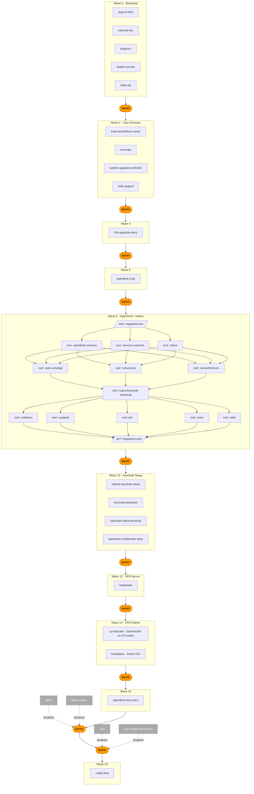

# Overview


# Project Goal

- Perform most of the heavy lifting for setting up a Kubernetes cluster on Hetzner with a set of preconfigured applications, which should meet the needs of hard/software developers of SME.
- It is not meant to be an "all-in-one", "ready-to-deploy-and-use" solution, but rather a starting point and reference implementation for further development and adjustments to your needs.
- The infrastructure follows best practices in terms of reproducibility, GitOps (via ArgoCD).
- The project is meant to be modular. You can easily add/remove applications and adjust the deployment to your needs.
- openDesk is used as a base installation, especially for the user management and self-service portal. You can de-select applications you don't need.
- This project was not audited for security, so it should not be used in production environments without further adjustments and hardening.

# Cluster Bootstrapping process

## Prerequisites

- Hetzner Account
    - API Token
    - eMail address: no-reply@your-domain.tld (for lets encrypt certificate registration and eMail notifications)
    - S3 Bucket access
        - Access key
        - Secret key
    - SSH Key (e.g. sshkey_ed25519_edgecloudinfra_Martin)
- Github account to fork this repo and a classic access token with pull request permissions (for renovate / automated checking for updates)
- A good Password manager, because you will create a lot secrets during the bootstrapping process, which you need to keep track of.
- Some time ~3 hours for initial setup:
    - 1h setup (git clone, startup DevContainer, URL adjustments, enter secrets)
    - 1h passive/automated infrastructure provisioning and app deployment via ArgoCD (~40 min including gitlab on 2x CX53 (16CPU/32GB/320GB))
    - 1h login, create accounts, add edge servers via VPN, test things
    - Probably some time to give me feedback and create issues ;)

## Configuration options

- See and edit project_settings.ts for pulumi infrastructure options / settings
- Update domain and subdomain. Invoke the script `./scripts/updateArgoCdFromProjectSettings.sh` to apply the new domain settings in ArgoCD.

## ArgoCD Sync Wave Overview

Deployment is fully automated via ArgoCD sync waves. Barriers are sync-guard apps that block the next wave until all apps in the current wave are healthy.
OpenDesk (wave 8) deploys its own internal sub-wave tree.



# Bootstrapping process

1. Configuration

- adjust project_settings.ts (clustername, URLs, hetzner servers, regions)
- Invoke `./scripts/updateArgoCdFromProjectSettings.sh` to apply the new domain settings in ArgoCD.
- adjust ArgoCD-deployed OpenDesk:
  edit `deployment/argocd/opendesk-chart-overrides.yaml`

```
global:
additionalMailDomains: - "domainA.tld" - "domainB.tld" - "domainC.tld" #
```

- Create secrets

    **Step 1 — Pulumi config** (`./scripts/setPulumiSecrets.sh`):

    | Secret                             | Where to get it                                                      |
    | ---------------------------------- | -------------------------------------------------------------------- |
    | Hetzner API token                  | Hetzner Cloud Console → Security → API Tokens                        |
    | Hetzner S3 access key + secret key | Hetzner Console → Object Storage                                     |
    | Storagebox password                | Hetzner Console → Storage Boxes                                      |
    | ArgoCD admin password              | Choose freely (min. 8 chars)                                         |
    | ArgoCD server secret key           | Choose freely (random string, e.g. `openssl rand -hex 32`)           |
    | Sealed-secrets TLS keypair         | Generated automatically on first deploy; paste existing on re-deploy |
    | WireGuard keypairs                 | Generated automatically on first deploy; paste existing on re-deploy |

    **Step 2 — Sealed secrets** (run each `sealSecrets.sh` before `make up` — no live cluster needed):

    | Script                                              | Prompts for                                                                               |
    | --------------------------------------------------- | ----------------------------------------------------------------------------------------- |
    | `./deployment/secrets/sealSecrets.sh`               | SMTP host, port, username, password; notification recipient email                         |
    | `./deployment/argocd/sealSecrets.sh`                | _(none — generates OIDC client secret automatically)_                                     |
    | `./deployment/headscale/sealSecrets.sh`             | _(none — generates OIDC client secret automatically)_                                     |
    | `./deployment/kube-prometheus-stack/sealSecrets.sh` | Grafana admin username + password                                                         |
    | `./deployment/renovate/sealSecrets.sh`              | GitHub Classic Access Token (needs `read:packages`, `read:org`, pull request permissions) |
    | `./deployment/gitlab/sealSecrets.sh`                | GitLab root password _(only when gitlab.yaml is enabled / not suffixed with .disable)_    |

    > Sealed secrets are encrypted with the sealed-secrets public key from Pulumi config and are safe to commit.
    > Each script offers to commit and push automatically after sealing.

2. Create Infrastructure
    - add PULUMI_PASSPHRASE to your environment: `source ./scripts/initPulumi.sh`
    - invoke `make create`
    - Wait ~ 15 Minutes
    - Login to ArgoCD URL (Pulumi stack output) and monitor the server's resource usage `./scripts/printResources.sh`
    - You will receive staged email notifications as services become ready
        **Cluster bootstrap complete** — after all waves finish
        - Check ArgoCD UI for detailed status at any time.

3. Post-bootstrapping configuration
    - Test if admin wireguard VPN is working. If this does not work, the next steps will lock you out of the cluster.
    - set deployment type to "production" in project_settings.sh
    - run `make up` again to apply production settings and restrict the firewall

4. First time login to openDesk dashboard as administrator
    - Retrieve the automatically generated administrator password: `./scripts/getNubusAdminPassword.sh`
    - Login to https://portal.testNN.domain.tld"
    - Follow the instructions and create a TOTP
      (--> select "Cannot scan QR code?" --> Copy the Key and paste it into your password manager supporting TOTP.

# Cluster Lifecycle — Shutdown and Restore

## Graceful shutdown (preserve data)

`make shutdown` stops the cluster without deleting infrastructure or S3 data so it can be restored later.

```
make shutdown
```

**What it does:**

1. Sets `completeClusterTeardown: false` in `project_settings.ts`
2. Runs `pulumi up` to sync the teardown flag into the stack
3. Creates an on-demand etcd snapshot and uploads it to S3 (`edgecloud-etcd` bucket)
4. Triggers Longhorn S3 backups for all volumes
5. Drains all cluster nodes (graceful pod eviction)
6. Runs `pulumi dn` — destroys servers, DNS, and network (S3 buckets are kept because `completeClusterTeardown=false`)
7. Sets `restoreClusterFromS3Backup: true` in `project_settings.ts`

**After shutdown:** commit the changed `project_settings.ts`, then run `make create` — k3s will restore etcd from the latest S3 snapshot automatically.

## Full destroy (delete everything)

`make destroy` tears down all infrastructure. With `completeClusterTeardown: true` it also deletes all S3 buckets and their contents (irreversible).

```
# set completeClusterTeardown: true in project_settings.ts for full wipe
make destroy
```

With `completeClusterTeardown: false` the servers and DNS records are deleted but S3 buckets (etcd snapshots, Longhorn backups, application data) are kept.

## Cluster lifecycle reference

| Command        | Infrastructure | S3 data  | Restorable |
| -------------- | -------------- | -------- | ---------- |
| `make shutdown`| Destroyed (pulumi dn) | Kept | Yes        |
| `make destroy` (teardown=false) | Deleted | Kept | With fresh cluster |
| `make destroy` (teardown=true) | Deleted | **Deleted** | No |
| `make create`  | Provisioned    | —        | —          |

# Integrate on premises edge servers

Prerequisites: wireguard admin VPN connected, `kubectl` working.

**Step 1 — Generate the edge node scripts** (run from devcontainer):

```bash
./scripts/generateEdgeJoinScript.sh
```

This script:

- Fetches the headscale pre-auth key from the cluster
- Retrieves the k3s token and CP0 VPN IP via SSH over wireguard
- Patches the k3s TLS SANs to include the headscale VPN IP (one-time, idempotent)
- Outputs two self-contained scripts in `tmp/`

**Step 2 — Copy scripts to the edge node and run in order:**

```bash
scp tmp/1_connectVPN.sh tmp/2_joinCluster.sh user@<edge-node>:/tmp/
ssh user@<edge-node> 'sudo bash /tmp/1_connectVPN.sh'   # install Tailscale, join headscale VPN
ssh user@<edge-node> 'sudo bash /tmp/2_joinCluster.sh'  # install k3s agent, join cluster
```

Verify from devcontainer:

```bash
kubectl get nodes   # edge node should appear as Ready
```

> `tmp/` is gitignored — the scripts contain secrets and must not be committed.

# Storage Strategy

The cluster uses two complementary storage layers: **Longhorn** for persistent block/file volumes inside the cluster, and **Hetzner Object Storage (S3-compatible)** for durable backups and application blob stores.

## Longhorn — distributed block storage

Longhorn is the default `StorageClass` for all PVCs. It runs on every node that carries the label `node.longhorn.io/create-default-disk=true`.

| Setting                   | Value               | Reason                                                         |
| ------------------------- | ------------------- | -------------------------------------------------------------- |
| `defaultReplicaCount`     | 2                   | one replica on CP, one on edge worker — cross-node redundancy  |
| `dataLocality`            | `best-effort`       | prefer local replica to avoid cross-VPN reads                  |
| `replicaSoftAntiAffinity` | `true`              | allow scheduling with fewer nodes available (e.g. during join) |
| `reclaimPolicy`           | `Retain`            | prevent accidental data loss on PVC deletion                   |
| Disk path                 | `/var/lib/longhorn` | same on all node types                                         |

**Node labeling is fully automatic:**

- Cloud CP nodes: labeled by Pulumi (`waitForK3sCp0SetupReady` command) with `node.longhorn.io/create-default-disk=true`.
- Cloud worker nodes: labeled via k3s `node-label` in Pulumi cloud-init.
- Edge worker nodes: labeled via `2_joinCluster.sh` at join time via k3s `node-label` config — no manual step required.

With 3 CP + 3 workers, Longhorn distributes replicas across all 6 nodes. Increasing `defaultReplicaCount` to 3 provides triple redundancy.

## S3 / Object Storage — backup and blob store

All buckets are on Hetzner Object Storage (`nbg1.your-objectstorage.com`). Pulumi creates missing buckets idempotently on every `pulumi up` and deletes them (with all contents) only when `completeClusterTeardown: true`.

| Bucket                      | Used by                | Purpose                                                                |
| --------------------------- | ---------------------- | ---------------------------------------------------------------------- |
| `edgecloud-etcd`            | k3s                    | etcd snapshots for cluster state recovery                              |
| `edgecloud-longhorn-backup` | Longhorn BackupTarget  | off-cluster PVC backups                                                |
| `edgecloud-gitlab`          | GitLab                 | artifacts, packages, registry, LFS, uploads, pages, … (9 object types) |
| `edgecloud-nextcloud`       | Nextcloud / OpenDesk   | primary file storage                                                   |
| `edgecloud-headscale`       | CloudNativePG + Barman | continuous WAL archiving + PITR for the headscale PostgreSQL database  |
| `edgecloud-mattermost`      | Mattermost             | file uploads and attachments                                           |

S3 credentials are stored as Sealed Secrets in the cluster; Pulumi injects them at provisioning time.

## kube-vip — API server high availability

kube-vip provides a stable virtual IP (`10.0.0.100`) for the k3s API server using ARP on the Hetzner private network (`enp7s0`). Leader election is done via a Kubernetes `Lease` — exactly one CP node holds the VIP at a time; failover is automatic.

Edge workers reach the VIP via a static route through the tailscale (headscale) VPN:

```
10.0.0.0/23 → CP0 tailscale VPN IP → Hetzner private network → 10.0.0.100
```

The route is installed and persisted by `2_joinCluster.sh` as a systemd service.

## Services pinned to control-plane nodes

The following DaemonSets must only run on CP nodes. Running them on edge workers causes failures because edge nodes have no Hetzner public IP and cannot reach CP pod-network CIDRs (`10.42.0.0/24`) directly.

- **haproxy-ingress** — terminates TLS on the Hetzner public IP; edge nodes have no matching external IP so kube-proxy would load-balance traffic to a pod that cannot reach any CP-hosted backend → 503. `nodeSelector: node-role.kubernetes.io/control-plane=true` set in `src/ingress.ts`.
- **cp-tailscale** — headscale VPN agent for the cluster's CP nodes; must co-locate with the headscale server. `nodeSelector: node-role.kubernetes.io/control-plane=true` set in `deployment/apps/wave12-headscale.yaml`.
- **kube-vip** — ARP-based VIP management for the k3s API server; only meaningful on nodes attached to the Hetzner private network. `nodeSelector: node-role.kubernetes.io/control-plane=true` set in `deployment/apps/wave0-kube-vip.yaml`.

Services that intentionally run on all nodes (including edge workers):

- **longhorn-manager / longhorn-csi-plugin** — distributed storage; edge nodes contribute disk capacity.
- **prometheus-node-exporter** — collects metrics from every node.
- **hcloud-csi-node** — uses node affinity `csi.hetzner.cloud/location: Exists`, so it automatically excludes edge nodes without Hetzner labels.
- **svclb-\*** — k3s klipper-lb pods for LoadBalancer services (e.g. dovecot-external, jitsi-jvb) whose external IP is the edge node's IP.

# FAQ:

## Why does Headplane return 404 on the root URL?

Headplane serves its UI under `/admin/`.

- Use: `https://headplane.testNN.domain.tld/admin/`
- `https://headplane.testNN.domain.tld/` returning `404` is expected.

## Why do you use OpenDesk?

It is a well maintained, open-source project with more features than we actually need, but it provides a good base for user management and a self-service portal. You can easily de-select applications you don't need.

## Minimum cloud resource requirements?

Bootstrapping works on a single CX53 server (16CPU/32GB/320GB):

- 20 GByte of DDR memory
- 1.5 of 16 CPUs (10%) are busy in idle state
- 50 GByte block SSD storage
- 1 TB object/S3 bucket storage

## What does it cost?

- 26€ monthly costs (no redundance, single control plane server):
    - 16€ Server: CX53 (16CPU/32GB/320GB)
    - 5€ 100 GByte SSD Block storage
    - 5€ Object storage / S3 bucket

- 47€ monthly costs (with high availability (HA), 3 Kubernetes control plane servers):
    - 32€ (2x 16€) server CX53 (16CPU/32GB/320GB)
    - 5€ server CX33 (4CPU/8GB/80GB)
    - 5€ 100 GByte SSD Block storage
    - 5€ Object storage / S3 bucket

## Lets encrypt staging vs. production certificates

- If you re-create the cluster multiple times within a couple of days, you might hit the rate limits of Let's Encrypt production certificates.
- I use subdomains for testing like `myAweseomeCluster, which are set it in `project_settings.ts` (`subdomain`), then run `./scripts/updateArgoCdFromProjectSettings.sh` to apply updated domain settings in ArgoCD.
- in Pulumi you can select between staging or production certificates, see `setting project_settings.ts` ("certIssuerType") and running `./scripts/updateArgoCdFromProjectSettings.sh` to apply the new domain settings in ArgoCD.
    - Hint: To open a website with an untrusted (or staging) certificate in chrome just type `thisisunsafe` in Vivaldi (probably other chrome-based browsers too)

## Why ArgoCD?

It is a well known GitOps tool, which allows us to deploy applications in a declarative way. It also provides a nice UI to monitor the deployment status and logs.

### Why don't you use a separate git repository for ArgoCD?

It is a good practise to keep cluster infrastructure and application deployment separate. Here we want to keep everything in one repository for simplicity. In a production environment with different infra/deployment teams, you might want to separate them.

## Why Hetzner?

I am hosting several private stuff on Hetzner for years and I am very happy. They offer a good balance between price and performance and up-time. They also have good API support.
So the answer is: I am familiar with Hetzner. But the code base is meant to be easily adaptable to other cloud providers, especially via SECAPI. --> Roadmap

## Helper scripts

TODO
see ./scripts

## Secrets in git - are you crazy?

In general: Bad idea! But here, the secrets are encrypted. I think this is okay if you push them in non-public repositories and if it is not a production environment.

- Pulumi: Secrets are en/decrpyted with the Pulumi_Passphrase.
- ArgoCD: Secrets are encrypted with a mechanism called SealedSecrets. You create the key for this in Pulumi and encrypt secrets for ArgoCD within the folder /deployment. Pulumi passes the key to ArgoCD, which can then decrypt thos secrets at deploy-time.

## Why testing with testNN subdomains?

I recreated the cluster around 100 times. To avoid hitting the rate limits of Let's Encrypt production certificates, I use the subdomains "\*.testNN." (incrementing number) for my tests and increment regularly (adjust project_settings.ts and run `./scripts/updateArgoCdFromProjectSettings.sh` to apply the new domain settings in ArgoCD).

Also in in my office there is a DNS proxy, which caches DNS entries with a long TTL. So after re-creating the cluster the IP addreses changed, but the DNS were still cached with the old IPs. By using different subdomains, I can avoid this issue.

# Development

## Pre-commit checks

- This repo uses a local Git hooks directory at `.githooks/`.
- Activate it in each clone with `make hooks`.
- The `pre-commit` hook runs `make precommit`, which only processes staged `*.ts` files.
- `make precommit` formats staged TypeScript files, re-stages them, then runs `npx tsc --noEmit`.
- To run checks on all TypeScript files manually, use `make precommit-all`.
- As users will customized domains, there is a script 'scripts/prepareRelease.sh' which replaces custom domains with "domain.tld" in the project_settings.ts and propagates this to argocd-deployments ('/deployment'). The script is meant to be run before creating a release and will change the domain back to your setting after you committed.

# Acknowledgements

- CAPE EU project (cape-project.eu)

## Open source tools used

- TODO: List all used tools with links to their gits
- TODO: Tell people to give these project a star

# Roadmap

- Test, test, test
- Harden the cluster for production use
- Generalize setup and make it work for other cloud provider --> SECAPI
- Move repository to github.com/cape-project-eu
