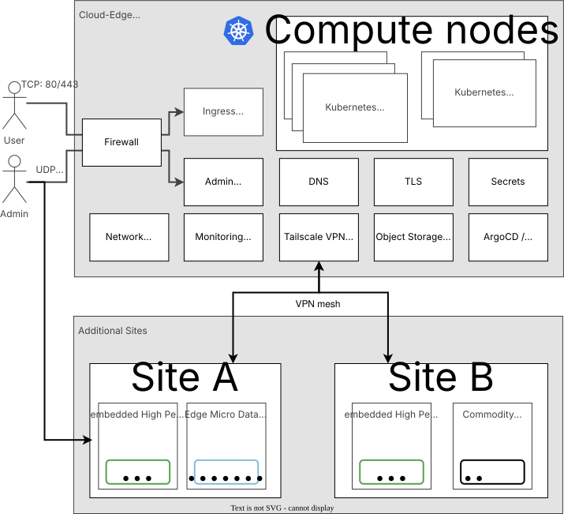
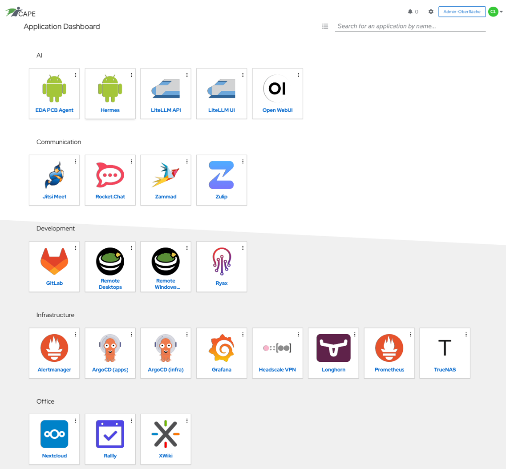
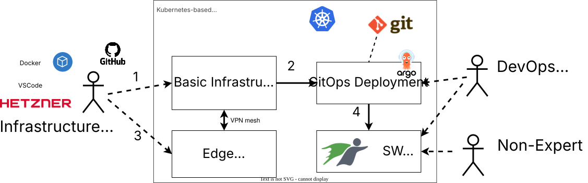
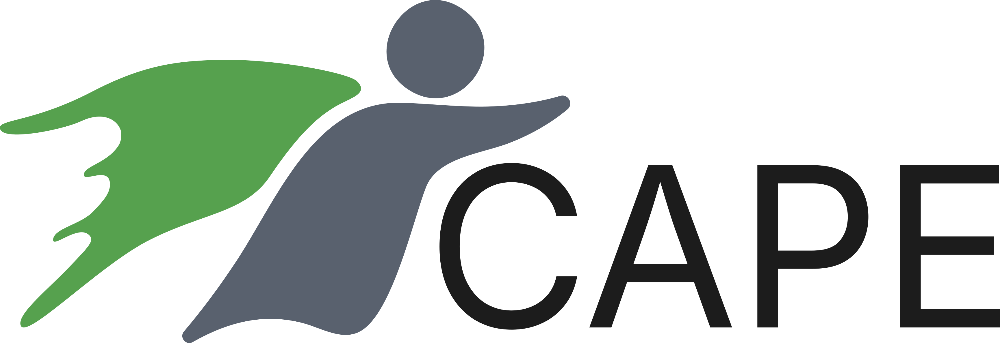

# Overview

This projects helps you to setup a complete Kubernetes Edge-Cloud Cluster within minutes using the Infrastructure-from-Code tool [Pulumi](https://www.pulumi.com) and GitOps via [ArgoCD](https://argoproj.github.io/cd/). The cluster is designed with a focus on edge-first workloads, where the control-plane and basic infrastructure run in the cloud ([Hetzner](https://www.hetzner.com)), while worker nodes can be added on-premises at the edge via VPN. The project includes a set of preconfigured applications commonly used by developers in SMEs, such as Nextcloud, XWiki, GitLab, Jitsi, and more - all integrated with Authentik for single sign-on.

Within the [European-funded project CAPE](https://ecc135.cape-project.eu/), this infrastructure serves as a reference implementation and playground for testing various applications, configurations, and edge scenarios and will be continuously developed and improved with the goal to have create a cloud-provider-agnostic bootstrapping setup using the sovereign cloud API [SECAPI](https://www.secapi.eu/).

<table>
  <tr>
    <td width="50%">
      
    </td>
    <td width="35%">
      
    </td>
  </tr>
</table>

# Project Goals

- Perform most of the **heavy lifting for setting up a Kubernetes cluster** on Hetzner with a set of preconfigured applications, which should meet the needs of hard/software developers of SME.
- Provide a **reference implementation** with a solid infrastructure software stack: Identify and Access Management (IAM) provider, monitoring, backup, restore, high availability, etc.
- **"Edge-first for workloads"**: Use cloud servers to setup the basic infrastructure. Edge-worker nodes attach to the cloud infrastructure via VPN and provide cost-effective and privacy-preserving on-site calculations.
- **IfC and GitOps**: The infrastructure follows best practices in terms of infrastructure from code (IfC via Pulumi) and GitOps reproducibility via ArgoCD.
- **Modular approach**: You can easily add/remove applications and adjust the deployment to your needs, e.g., you can to use multiple control plane nodes to achieve high-availability.
- **Updates via GitOps**: By using renovate, all software components of this project can be easily maintained/updated via automated Github pull requests. If something broke, just revert the commit and the cluster will self-heal.
- **Flexible edge-cloud architecture**: Edge nodes are considered ephemeral and can be added/removed at any time. The cluster is be able to handle this autonomously and allows applications to move between cloud and edge nodes.
- **Open Source first**: All used components are open source and can be replaced by alternatives if needed.

# Cluster Bootstrapping process

1. **Cloud Infrastructure setup:**
   The infrastructure engineer opens the provided devcontainer, creates a new Pulumi stack and seals the secrets (e.g. provider access tokens) using the provided shell scripts. After modifiying the file [project_settings.ts](project_settings.ts), which is the single source of truth for Pulumi and cluster configuration, Pulumi will setup the described Infrastructure as Code in the cloud. This includes networking, storage, DNS, TLS certificates and initial OS-provisioning and Kubernetes setup on cloud servers. Finally ArgoCD will be started.

2. **GitOps Deployment:**
   ArgoCD continuously monitors a configurableGit repository for changes. The minimal implementation contains the basic infrastructure: A self-managing ArgoCD, Prometheus and Grafana for monitoring, renovate update management, followed by [Authentik](https://goauthentik.io) for Identity and Authorization (IaM) management including an application dashboard/portal and [headscale](https://github.com/juanfont/headscale) / [headplane](https://github.com/juanfont/headplane) for VPN management.

    The initial software stack contains a pre-configured nextcloud for ofice and file storage, a xwiki for documentation and a gitlab for code hosting and CI/CD. All applications are integrated with Authentik for single sign-on (SSO). Finally the RYAX workflow orchestration engine is deployed using a helm chart.

3. **Edge node integration:**
   After the VPN server is online, used as an VPN service provider to establish a virtual network between cloud and edge nodes. The edge nodes connect outbound to the cloud VPN and join the cloud’s Kubernetes cluster.
   The infrastructure engineer can choose between two ways to integrate edge servers into the cloud-edge server:

    (a) Fully automated, Pulumi-based, by defining the edge nodes in [project_settings.ts](project_settings.ts) and running `make provision-edge`

    (b) Manual provisioning using a self-contained script including manual approval via the headplane admin portal. This is useful for integrating and onboarding of transient edge nodes by non-infrastructure experts.

4. **Run-time usage:**
   DevOps Engineers can monitor the cluster and start deploying their applications and workloads using ArgoCD or RYAX. The Ryax web-based user interface can now be used by non-expert developers or users to deploy preconfigured applications like LLMs or vision processing algorithms (ClickOps), or use a low-code approach.

# Deployment Overview

The deployed set of applications is categorized into two groups: Infrastructure Apps and User Apps. The infrastructure apps are required for the cluster to run and are deployed by Pulumi and ArgoCD as part of the bootstrapping process.
The user apps are optional and can be deployed by users via ArgoCD.

## Infrastructure Apps

The list shows REQUIRED infrastructure applications.
ToDo update!

| App                  | RAM      | Storage (PVC) | Deployed by | Purpose                                     |
| -------------------- | -------- | ------------- | ----------- | ------------------------------------------- |
| ArgoCD               |          |               | Pulumi      | GitOps                                      |
| ArgoCD               |          |               | ArgoCD      | Self-update controller                      |
| Authentik            |          |               | ArgoCD      | Identity and Access Management              |
| Cert-Manager         |          |               | ArgoCD      | TLS Certificates                            |
| External-DNS         |          |               | ArgoCD      | DNS management                              |
| HAProxy Ingress      |          |               | ArgoCD      | Ingress Controller                          |
| Headscale            |          |               | ArgoCD      | VPN                                         |
| Headplane            |          |               | ArgoCD      | VPN dashboard                               |
| Longhorn             |          |               | Pulumi      | Shared block storage between cloud nodes    |
| Prometheus & Grafana |          |               | ArgoCD      | Monitoring & dashboard                      |
| Renovate             |          |               | ArgoCD      | Software updates via Github pull requests   |
| Wireguard            |          |               | Pulumi      | Dedicated VPN connection for admin purposes |
| **Total**            | **TODO** | **TODO**      | -           | -                                           |

## User Apps

User configurable OPTIONAL applications.

| App            | RAM         | Storage (PVC) | Purpose                  |
| -------------- | ----------- | ------------- | ------------------------ |
| Hello ArgoCD   | 12Mi        | —             | Hello World website demo |
| GitLab         | 5902Mi      | 75Gi          | Code Hosting             |
| GitLab Runner  | 57Mi        | —             | CI/CD, requires Gitlab   |
| Jitsi          | 890Mi       | 32Gi          | Video Conferencing       |
| Nextcloud      | 607Mi       | 20Gi          | Office, file sharing     |
| Rallly         | 547Mi       | 4Gi           | Polling                  |
| RocketChat     | 1220Mi      | 16Gi          | Messaging                |
| RyaxNS         | 2985Mi      | 154Gi         | Workflow Orchestration   |
| Windows Remote | 1128Mi      | 75Gi          | Remote Access            |
| XWiki          | 1748Mi      | 13Gi          | Documentation            |
| Zulip          | 4947Mi      | 32Gi          | Messaging                |
| **Total**      | **20043Mi** | **421Gi**     |

# Setup Instructions

Enough said! Let's start creating your edge-cloud cluster --> [Setup instructions](doc/setup-instructions.md)

# Architecture and Implementation Details

[Architecture overview](doc/architecture.md)

[cluster-lifecycle-management.md](cluster-lifecycle-management.md)

[Storage architecture](doc/architecture.md)

[High-availability strategy](doc/high-availability.md)

[Development](doc/development.md)

# Frequently Asked Questions

Cloud resource requirements

See table in README.md bottom. TODO linkme

Bootstrapping works on a single server with

- 24 GByte of DDR memory
- 1.5 of 16 CPUs (10%) are busy in idle state
- 1 TB object/S3 bucket storage

What does it cost?

--> TODO update

- 26€ monthly costs (no redundance, single control plane server):
    - 16€ Server: CX53 (16CPU/32GB/320GB)
    - 5€ 100 GByte SSD Block storagproject_settings.tse
    - 5€ Object storage / S3 bucket

- 47€ monthly costs (with high availability (HA), 3 Kubernetes control plane servers): - 32€ (2x 16€) server CX53 (16CPU/32GB/320GB) - 5€ server CX33 (4CPU/8GB/80GB) - 5€ 100 GByte SSD Block storage - 5€ Object storage / S3 bucket
    

Lets encrypt staging vs. production certificates

- If you re-create the cluster multiple times within a couple of days, you might hit the rate limits of Let's Encrypt production certificates.
- I use subdomains for testing like `myAwesomeCluster`, which are set in [project_settings.ts](project_settings.ts) (`subdomain`), then run `./scripts/environment/updateConfigFromProjectSettings.sh` to apply updated domain settings in ArgoCD.
- in Pulumi you can select between staging or production certificates, see [project_settings.ts](project_settings.ts) ("certIssuerType") and running `./scripts/environment/updateConfigFromProjectSettings.sh` to apply the new domain settings in ArgoCD. - Hint: To open a website with an untrusted (or staging) certificate in chrome just type `thisisunsafe` in Vivaldi (probably other chrome-based browsers too)
    

Why ArgoCD?

It is a well known GitOps tool, which allows us to deploy applications in a declarative way. It also provides a nice UI to monitor the deployment status and logs.

Why don't you use a separate git repository for ArgoCD?

It is a well known GitOps tool, which allows us to deploy applications in a declarative way. It also provides a nice UI to monitor the deployment status and logs.
It is good practice to keep cluster infrastructure and application deployment separate. Here we want to keep everything in one repository for simplicity. In a production environment with different infra/deployment teams, you might want to separate them.

Why Hetzner as cloud provider?

I am hosting several private stuff on Hetzner for years and I am very happy. They offer a good balance between price and performance and up-time. They also have good API support.
So the answer is: I am familiar with Hetzner. But the code base is meant to be easily adaptable to other cloud providers, especially via SECAPI. --> Roadmap

Why didn't you use openDesk?

I started with [opendesk](https://www.opendesk.eu/) TODO fix link, because it sounded like a good fit for our use case and is well maintained, production-ready and used by the german government.
But after deploying it the footprint was too high. It required more than 24 Gbyte RAM to deploy most of the apps. The IaM components Nubus/keycloak were very resource hungry and the encapsulated approach of opendesk made it difficult to configure these components to fit my needs. So I decided to build this cluster infrastructure from scratch using separate tools.

Secrets in git - are you crazy?

In general: Bad idea! But here, the secrets are well encrypted using kubeseal. See this [article](https://aws.amazon.com/de/blogs/opensource/managing-secrets-deployment-in-kubernetes-using-sealed-secrets/) for a detailed explanation.

- Pulumi: Secrets are encrypted/decrypted with the Pulumi passphrase.
- ArgoCD: Secrets are encrypted with a mechanism called SealedSecrets. You create the key for this in Pulumi and encrypt secrets for ArgoCD within the folder /deployment. Pulumi passes the key to ArgoCD, which can then decrypt thos secrets at deploy-time.
  

Why testing with subdomains?

I recreated the cluster around 100 times. To avoid hitting the rate limits of Let's Encrypt production certificates, I use a subdomains like "\*.testNN." (incrementing number) for my tests and increment regularly (adjust project_settings.ts and run `./scripts/environment/updateConfigFromProjectSettings.sh` to apply the new domain settings in ArgoCD).

Also in my office there is a DNS proxy, which caches DNS entries with a long TTL. So after re-creating the cluster the IP addresses changed, but the DNS were still cached with the old IPs. By using different subdomains, I can avoid this issue.

# Acknowledgements

<table>
  <tr>
    <td width="25%">
      
    </td>
    <td width="65%">
This work is part of the <a href="https://www.cape-project.eu">CAPE project</a>, which has received funding from the European Union's Horizon Europe research and innovation programme under grant agreement No 101135. The content of this project reflects only the authors' view and the European Commission is not responsible for any use that may be made of the information it contains.
    </td>
  </tr>
</table>

# Disclaimer

- This project was not audited for security, so it should not be used in production environments without further adjustments and hardening.
- It is not meant to be an "all-in-one", "ready-to-deploy-and-use" solution, but rather a starting point and reference implementation for further development and adjustments to your needs.

# Open Source Strategy

All used software parts in this project are open source and can be replaced by alternatives if needed.

# Publications

The basic infrastructure for this project was published at the [Computer Frontiers 2026 conference](https://www.computingfrontiers.org/2026/), as part of a multi-partner project presentation. The paper can be downloaded [here CAPE's Composable Server Infrastructure for the Edge-Cloud Continuum.pdf](https://cape-project.eu/wp-content/uploads/2026/05/2026-05-20_CF26_CAPEs_Composable_Server_Infrastructure_web.pdf)

# Roadmap

- see [ToDo.md](ToDo.md) for detailed tasks and next steps
- Improve documentation, add more screenshots
- Test, test, test
- Harden the cluster for production use
- Generalize setup and make it work for other cloud provider --> SECAPI
- Move repository to github.com/cape-project-eu
