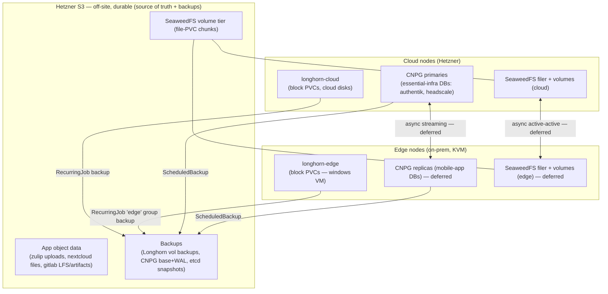

# Cloud↔Edge Architecture

```
on-premise-resident A ←── direct WireGuard (Tailscale mesh) ──→ on-premise-resident B
         │                                                                │
         └──────────────── Headscale DERP/mesh ───────────────────────────┘
                                      │
                     Cloud CP (advertises 10.0.0.0/23 subnet)
                     k3s-api.ts.internal → 10.0.0.100
```

> Status: foundation + SeaweedFS deployed; CNPG mobility conversions and the
> restore/edge-reconnect automation are **deferred until edge nodes exist**
> (`project_settings.ts` `nodes.edge`). Items marked _(deferred)_ are designed but
> not yet wired.

## Placement tiers

Each wave-≥20 app declares a tier via the annotation `placement.ecc/tier` on its
ArgoCD `Application`. Essentials default to `cloud` (`project_settings.ts`
`placement.defaultTier`).

| tier    | meaning                                        | scheduling                     | storage                       | restored at cloud creation? |
| ------- | ---------------------------------------------- | ------------------------------ | ----------------------------- | --------------------------- |
| `cloud` | essential, cluster-critical                    | required cloud                 | `longhorn-cloud` / S3         | yes                         |
| `flex`  | non-essential; placed where resources are free | preferred edge, cloud fallback | SeaweedFS (files) + CNPG (DB) | no _(deferred)_             |
| `edge`  | edge-only (needs KVM)                          | required edge                  | `longhorn-edge` / S3          | no                          |

Current assignment: `flex` = zulip, rocketchat, xwiki, rallly, jitsi, nextcloud;
`edge` = windows; everything else `cloud`.

**Edge-vs-cloud preference for `flex` apps.** The `tier` only governs _restore_
behaviour (non-`cloud` = off-cloud at creation). Which side a `flex` app _prefers_ is
orthogonal — expressed via a second annotation `placement.ecc/prefer: edge|cloud`
(default `edge`). It maps to the `preferredDuringSchedulingIgnoredDuringExecution`
weight in the app's `nodeAffinity` (higher weight on edge labels vs cloud), so the
scheduler leans that way but still falls back to the other tier. This takes effect once
`flex` apps carry tier-aware affinity (part of the deferred mobility work); the tier
stays `flex` either way.

**Core rule — pod placement ≠ volume placement.** A Longhorn volume's replicas live
where its StorageClass disk/node-selector says, regardless of where the pod is
scheduled. Moving an app to edge means moving its _state backends_ (file→SeaweedFS,
DB→CNPG), not just rescheduling the pod. Raw block (windows VM) can't be offloaded to
object storage, so it stays `longhorn-edge` on an edge node.

## Storage hierarchy



### StorageClasses

| StorageClass               | provisioner   | replicas pinned to                                       | use                                                                                                             |
| -------------------------- | ------------- | -------------------------------------------------------- | --------------------------------------------------------------------------------------------------------------- |
| `longhorn-cloud` (default) | Longhorn      | cloud disks (`diskSelector cloud` when edge nodes exist) | all cloud PVCs                                                                                                  |
| `longhorn-edge`            | Longhorn      | edge disks (`diskSelector edge`)                         | edge-only block (windows); created only when `nodes.edge` non-empty; joins the `edge` RecurringJob backup group |
| `seaweedfs`                | SeaweedFS CSI | n/a (object-backed)                                      | mobile-app file PVCs                                                                                            |

## SeaweedFS (file layer)

Deployed at wave 0 (cluster) + wave 2 (CSI driver / `seaweedfs` StorageClass).
Master + volume + filer with an embedded S3 gateway; volume blobs and filer metadata
persist on `longhorn-cloud`. _(Deferred: per-site edge filer + async active-active xDC
replication + S3 cloud-tiering — need an edge node to place the second filer.)_

## Databases (CNPG)

Mobile apps' Postgres becomes a CNPG `Cluster` (pattern:
`deployment/infrastructure/authentik/postgres.yaml`) with an async **replica cluster** on the
other tier _(deferred)_; migration = `kubectl cnpg promote` on the target tier.

**Converted to CNPG (cloud-side, done):** all plain-Postgres apps now run a CNPG
`Cluster`, with the app pointed at the cluster's `-rw` service and a
`<app>-pg-user` sealed secret (wave -1, keys `username`/`password`) for initdb:

| App                 | Cluster        | StorageClass     | Notes                                                                                    |
| ------------------- | -------------- | ---------------- | ---------------------------------------------------------------------------------------- |
| rallly              | `rallly-pg`    | `longhorn-cloud` | cloud pilot                                                                              |
| xwiki               | `xwiki-pg`     | `longhorn-cloud` |                                                                                          |
| nextcloud           | `nextcloud-pg` | `longhorn-cloud` | DB host also lives in persisted `config.php` on the data PVC                             |
| windows (guacamole) | `guacamole-pg` | `longhorn-edge`  | edge-tier: `ecc/kvm` nodeSelector + edge toleration; Pending until a KVM edge node joins |

(authentik, headscale, gitlab, jitsi were already CNPG.)

**Still deferred per app:** the async **cross-tier replica cluster** + `kubectl
cnpg promote` cutover, and barman S3 backups (these apps have no dedicated pg S3
bucket yet) — both need edge nodes.

**Remaining non-CNPG (accepted exceptions):**

- **zulip** stays on its own `StatefulSet` (`deployment/apps/zulip/datastores.yaml`,
  image `zulip/zulip-postgresql:14`). Its DB requires the **pgroonga** full-text-
  search extension, which the stock CNPG image lacks. Investigated 2026-06: there is
  **no existing CNPG-compatible pgroonga image** — pgroonga is not in CNPG's
  [extension catalog](https://github.com/cloudnative-pg/postgres-extensions-containers),
  and the official `groonga/pgroonga` images are built on the plain `postgres` image,
  not the CNPG operand base the operator requires (uid 26, instance-manager
  injection, barman-cloud, pgdg layout, version-by-tag). Converting would mean
  building+publishing a custom `FROM ghcr.io/cloudnative-pg/postgresql:18` +
  `postgresql-18-pgroonga` image (and a PG14→18 dump/restore, since CNPG defaults to
  18). Deferred as not worth the per-app image-maintenance burden while the replica
  payoff is itself edge-gated. Zulip mobility, if needed, would be app-level
  export/import rather than a CNPG replica.
- **rocketchat** uses MongoDB → cross-site replica set instead of CNPG. The
  cloud-side prep is built: the edge `rs0` member (`mongodb-edge.yaml`) + `rs-init`
  logic to add it as votes:0/priority:0, plus the cutover runbook below. The edge
  member is Pending until an edge node joins (like the other edge-tier DBs).

## Scheduling priority (graceful degradation)

PriorityClasses (`deployment/infrastructure/priorityclasses/`), highest→lowest:
`platform` > `essential` > `standard`... see table:

| class                 | value   | apps                                                                       |
| --------------------- | ------- | -------------------------------------------------------------------------- |
| `platform`            | 2000000 | argocd, longhorn, cert-manager, kube-vip, ingress, sealed-secrets, coredns |
| `essential`           | 1000000 | authentik, headscale                                                       |
| `high`                | 100000  | gitlab, nextcloud                                                          |
| `standard`            | 10000   | zulip, rocketchat, xwiki                                                   |
| `low` (no preemption) | 1000    | rallly, jitsi, windows                                                     |

On a resource-tight (e.g. cloud-only at restore) cluster the scheduler admits
important apps first; `low` apps stay Pending instead of evicting anyone. `edge`-only
apps use _required_ edge affinity, so they never compete for cloud resources.
Currently assigned on the DB/datastore manifests + CNPG clusters; assigning it on the
Helm app _pods_ (via each chart's values) is a follow-up.

## How to pin an app to a tier

In the app's ArgoCD `Application` manifest:

```yaml
metadata:
    annotations:
        placement.ecc/tier: flex # cloud | flex | edge
```

plus, in the workload: `nodeAffinity`/`nodeSelector` to the tier (edge nodes carry
`node-role.kubernetes.io/edge: edge` / `node.kubernetes.io/edge-worker: "true"`; the
windows VM additionally needs `ecc/kvm: "true"`), and the right `storageClassName`
(`longhorn-cloud` / `longhorn-edge` / `seaweedfs`).

## How to migrate a `flex` app cloud↔edge (cutover runbook) — _(deferred)_

1. `kubectl cnpg promote <cluster>` on the target tier (replica → primary).
2. Re-point the app at the new primary; flip its `nodeAffinity` to the target tier.
3. `argocd app sync <app>`. SeaweedFS file data is already replicated; caches re-warm.

Stateless apps (jitsi) migrate by flipping affinity alone — fully online. Stateful
apps are near-online (promote + rewarm), never synchronous WAN block IO. There is **no
automatic cross-tier migration**; it's a deliberate admin action.

### RocketChat (MongoDB) cutover — the Mongo analog of `cnpg promote`

RocketChat's state is a MongoDB replica set `rs0`, not a CNPG cluster. The cloud
member (`rocketchat-mongodb-0`) is the default PRIMARY (priority 1, votes 1). The
edge member (`rocketchat-mongodb-edge-0`, `deployment/apps/rocketchat/mongodb-edge.yaml`,
pinned to the edge tier on `longhorn-edge`) is added to `rs0` by the `rs-init` Job as
**`votes:0, priority:0`** — it replicates the data but cannot win an election, so the
cloud member keeps its 1-of-1 election majority while the (intermittent) edge is
offline. The edge StatefulSet stays Pending until an edge node joins.

To promote the edge member (cutover cloud→edge), once it is `SECONDARY` and caught up:

```js
// mongosh against the current PRIMARY (cloud), as root:
cfg = rs.conf();
const cloud = cfg.members.find((m) => m.host.startsWith("rocketchat-mongodb-0."));
const edge = cfg.members.find((m) => m.host.startsWith("rocketchat-mongodb-edge-0."));
edge.votes = 1;
edge.priority = 2; // edge can now win and is preferred
cloud.priority = 1; // (optionally cloud.votes/priority lower)
rs.reconfig(cfg); // triggers an election → edge becomes PRIMARY
```

Then flip RocketChat's pod `nodeAffinity` to the edge tier and `argocd app sync
rocketchat`. The app reaches the new PRIMARY via the same `?replicaSet=rs0` URI (the
driver follows the PRIMARY automatically — no URI change needed). Reverse the priority
to fail back. **Never give a permanently-offline member `votes:1`** — a down voting
member breaks `rs0`'s majority and leaves it without a PRIMARY (RocketChat goes
read-only/down).

## Restore & edge reconnection — _(deferred)_

On cluster recreate, etcd is restored from S3 (k3s token stable). For edge nodes to
reconnect unattended on an unchanged `/vpn` URL, Headscale's CNPG must recover its
registration DB from S3 (recovery bootstrap) and be excluded from the Longhorn volume
restore (so CNPG owns its consistent base+WAL recovery). Until that's wired, edge
nodes re-enroll via `scripts/runtime/generateEdgeJoinScript.sh`.
