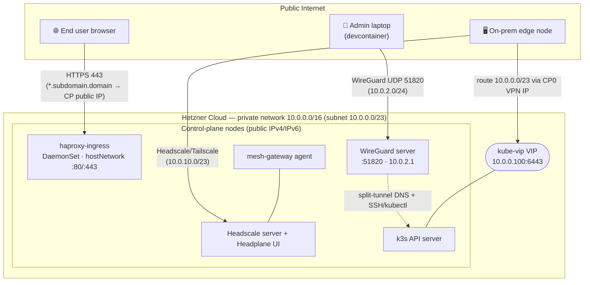
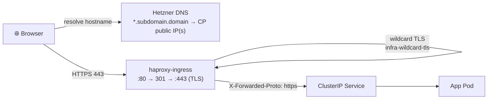

# project_settings.ts as single source of truth

## Substitution anchors

The script is **structure-independent**: it rewrites only the value on a line that
carries a trailing `# project-settings: <group>.<key>` comment (or `// …` in
`src/*.ts`). To keep a new manifest line in sync, add the matching anchor comment —
nothing else. Supported anchor groups and a few example values:

| Anchor              | Example line                                                             | Source in `project_settings.ts`                                               |
| ------------------- | ------------------------------------------------------------------------ | ----------------------------------------------------------------------------- |
| `network.<key>`     | `value: "10.0.0.100" # project-settings: network.vip`                    | `network.vip`                                                                 |
| `network.meshRange` | `MESH_RANGE="10.0.10.0/23" # project-settings: network.meshRange`        | `network.meshRange`                                                           |
| `ha.<key>`          | `instances: 3 # project-settings: ha.headscalePg`                        | `ha.replicas.headscalePg` (`max` when `general.highAvailability`, else `min`) |
| `ha.<key>` (Pulumi) | `replicaCount: 2, // project-settings: ha.certManagerWebhook`            | `ha.replicas.certManagerWebhook`                                              |
| `haAffinity.<key>`  | `enablePodAntiAffinity: true # project-settings: haAffinity.headscalePg` | `general.highAvailability` (boolean)                                          |

Domain/subdomain, GitHub repo URL, cert-issuer, S3 bucket names and ArgoCD
`targetRevision` are substituted by dedicated passes in the same script (not via the
generic anchor mechanism). See **High availability considerations** for what the
`ha.*` / `haAffinity.*` anchors control and why.

## Cluster Backup & Restore

### etcd snapshots

k3s backs up etcd automatically to S3. Frequency is controlled by `backupToS3IntervalHour` in `project_settings.ts` (default: every hour). Retention: 72 snapshots (3 days at hourly cadence). Snapshots are stored in the `edgecloud-etcd` S3 bucket under the `k3s-etcd/` folder.

This is configured in `src/nodes-k3s.ts` and baked into `/etc/rancher/k3s/config.yaml` on the control-plane node at provision time. It runs inside the k3s process and is independent of the Kubernetes API, so it continues to work even if the cluster is degraded.

Set `backupToS3IntervalHour: 0` to disable etcd backups.

**Restore etcd:**

Restore happens automatically on `make create` when `restoreClusterFromS3Backup: true` is set in `project_settings.ts`. k3s picks the latest snapshot from S3 and runs `--cluster-reset` before starting. No manual steps needed beyond setting the flag and committing before running `make create`.

To restore manually on a running control-plane node:

```bash
# list available snapshots
k3s etcd-snapshot ls --etcd-s3 --etcd-s3-bucket=<bucket> --etcd-s3-folder=k3s-etcd

# restore from a specific snapshot
k3s server --cluster-reset --cluster-reset-restore-path=<snapshot-name> --etcd-s3 --etcd-s3-bucket=<bucket> --etcd-s3-folder=k3s-etcd
```

### Longhorn volume backups

Longhorn backs up all PVCs in the `default` RecurringJob group to the S3 backup target (`edgecloud-longhorn-backup` bucket). Schedule is defined in `deployment/infrastructure/longhorn/recurring-jobs.yaml`:

| Job             | Schedule           | Type     | Retain      |
| --------------- | ------------------ | -------- | ----------- |
| snapshot-hourly | every hour         | snapshot | 72 (3 days) |
| backup-6hourly  | every 6 h (:30)    | backup   | 10          |
| backup-daily    | 02:30 daily        | backup   | 14          |
| backup-weekly   | 02:30 Sun          | backup   | 12 weeks    |
| backup-monthly  | 02:30 1st of month | backup   | 18 months   |
| backup-yearly   | 02:30 Jan 1        | backup   | 4 years     |

Backups use GFS-style retention via 4 independent jobs. Each job creates its own backup chain; on the same day multiple jobs may run (e.g. Jan 1 triggers daily + weekly + monthly + yearly). Longhorn does not deduplicate across jobs — changed blocks are uploaded per job.

Snapshots are local (on-node, fast, no S3 cost). Backups go to S3 and survive full cluster loss.

**Restore a Longhorn volume:**

1. Open the Longhorn UI → **Backup** tab
2. Select the backup for the volume you want to restore
3. Click **Restore** — creates a new volume from the backup
4. Update the PVC/PV to point at the restored volume, or let ArgoCD re-sync (the restored volume name must match)

# Networking

The cluster combines one Hetzner private network with **two independent VPN
layers** that serve different roles: a pure WireGuard tunnel for operator/admin
access, and a Headscale (Tailscale) mesh that lets on-premises edge nodes join
the cluster.



## Hetzner private network

| Setting       | Value         | Source (`project_settings.ts`) |
| ------------- | ------------- | ------------------------------ |
| Private range | `10.0.0.0/16` | `network.privateRange`         |
| Server subnet | `10.0.0.0/23` | `network.subnetRange`          |
| Gateway       | `10.0.0.1`    | `network.gateway`              |

All cloud nodes attach to this network (`src/network.ts`). Pod traffic between
nodes uses the Flannel VXLAN overlay (UDP 8472).

## Firewall

Rules are defined in `src/network.ts` and switch on `rolloutType`:

- **Bootstrap / Testing** — adds SSH (22), Kubernetes API (6443) and etcd-peer
  (2380, private only) on top of the production rules, so you can reach nodes
  directly during setup.
- **Production** — only HTTP (80), HTTPS (443), Jitsi (JVB UDP 10000 / TCP 4443,
  Coturn UDP 3478) and the WireGuard tunnel (UDP 51820) are exposed publicly. SSH
  and the API server are reachable only over the WireGuard VPN.

Switch to the locked-down ruleset by setting `rolloutType: "Production"` and
re-running `make up` (see [Step 4](#step-4--harden-for-production)).

## kube-vip — API server high availability

kube-vip provides a stable virtual IP (`10.0.0.100`) for the k3s API server using
ARP on the Hetzner private network. Leader election uses a Kubernetes `Lease` —
exactly one CP node holds the VIP at a time; failover is automatic. All nodes
(including edge workers) reach the API server through this VIP, so it stays valid
across control-plane changes.

## VPN layer 1 — WireGuard (operator / admin access)

A pure WireGuard server (`src/wireguard.ts`, no web UI) runs as a `hostNetwork`
Deployment pinned to a control-plane node, listening on UDP `51820`. It exists so
the admin can reach the cluster's private network (SSH to nodes, `kubectl` to the
API) once the firewall is locked down.

| Setting       | Value         | Source (`project_settings.ts`) |
| ------------- | ------------- | ------------------------------ |
| Subdomain     | `wg`          | `wireguard.subDomain`          |
| VPN subnet    | `10.0.2.0/24` | `wireguard.vpnSubnet`          |
| Server IP     | `10.0.2.1`    | `wireguard.serverAddr`         |
| Admin peer IP | `10.0.2.2`    | `wireguard.adminAddr`          |

- The server identity (keypair) is stored in Pulumi secrets so it survives
  cluster recreation.
- A sidecar **CoreDNS** answers `*.<subdomain>.<domain>` → the WireGuard server
  IP, so a split-tunnel client can reach cluster services by hostname without the
  public IP.
- A `prometheus-wireguard-exporter` sidecar exposes peer metrics to Prometheus.

Fetch the admin client config with `./scripts/runtime/getAdminWireguardConfig.sh`.

> ⚠️ Confirm the WireGuard VPN works **before** switching to Production — once the
> firewall closes SSH/6443, the VPN is your only way into the cluster.

## VPN layer 2 — Headscale / Tailscale (edge nodes)

[Headscale](https://headscale.net) is a self-hosted Tailscale control server
(deployed in wave 8, with the **Headplane** admin UI). It lets on-premises edge
servers join the cluster over a WireGuard mesh without a public IP.

| Component      | Role                                                                |
| -------------- | ------------------------------------------------------------------- |
| `headscale`    | Tailscale coordination server at `https://vpn.<subdomain>.<domain>` |
| `headplane`    | Admin GUI (served under `/admin/`)                                  |
| `mesh-gateway` | Tailscale agent DaemonSet on the control-plane nodes                |

- Edge VPN range: `10.0.10.0/23` (10.0.10.0–10.0.11.255).
- The control-plane `mesh-gateway` agent advertises a route to the Hetzner
  private subnet `10.0.0.0/23`; Headscale must **approve** that route (done
  automatically by `generateEdgeJoinScript.sh`, or manually in Headplane).
- Edge nodes install a static route `10.0.0.0/23 → CP0 VPN IP` so they can reach
  the kube-vip API VIP (`10.0.0.100:6443`) and join as k3s agents.

```
edge node → tailscale0 → CP0 VPN IP → Hetzner private network → 10.0.0.100:6443
```

The full edge-onboarding procedure is below.

## Ingress topology

External web traffic is served by **haproxy-ingress** (`src/ingress.ts`),
deployed as a `DaemonSet` with `hostNetwork: true` and pinned to the
control-plane nodes — so it binds ports 80/443 directly on each CP node's public
IP.



- **DNS:** Pulumi creates a wildcard record `*.<subdomain>.<domain>` (A + AAAA,
  one entry per CP node) pointing at the control-plane public IPs (`src/dns.ts`).
  Per-app `Ingress` hostnames are all covered by this wildcard; `external-dns`
  also reconciles records from Ingress objects.
- **TLS:** cert-manager issues a single wildcard certificate
  `infra-wildcard-tls` (`*.<subdomain>.<domain>`) via Let's Encrypt **DNS-01**
  using the Hetzner webhook (`src/certmanager.ts`,
  `deployment/infrastructure/argocd-infra/wildcard-certs.yaml`). HAProxy uses it as its
  `--default-ssl-certificate`, so every app gets TLS without its own cert.
- **Scheme:** HAProxy sets `X-Forwarded-Proto: https` so apps behind TLS
  termination (e.g. OIDC callbacks) build correct HTTPS redirect URLs.
- HAProxy must run only on CP nodes — edge workers have no matching public
  external IP (see [Services pinned to control-plane nodes](#services-pinned-to-control-plane-nodes)).

# Authentik — SSO portal & app tiles

## Authentik notes

- **App enabled** → its Application syncs → its `authentik-blueprint-<app>`
  ConfigMap appears in the `authentik` namespace → the worker's filesystem
  watcher picks up the new file under `/blueprints` and creates the tile (an
  hourly discovery cron is the backstop, so a tile can lag the app by up to ~1
  minute, ~1 hour worst case).
- **App disabled** → no Application → no ConfigMap → the optional mount stays
  empty → **no tile is ever created** (nothing to clean up).

> This relies on creation-time-only disabling. Authentik does **not** delete
> objects a blueprint created when the blueprint is later removed at runtime — so
> removing an app from a _running_ cluster leaves an orphaned tile until it is
> deleted manually (or via a `state: absent` blueprint entry).

[Authentik](https://goauthentik.io) (wave 6) is the cluster's identity provider
and **single sign-on portal**, reachable at `https://id.<subdomain>.<domain>`
(and the friendly alias `https://portal.<subdomain>.<domain>`). After login,
users see a dashboard of **tiles** for the apps their groups entitle them to.
All configuration is config-as-code via Authentik _blueprints_
(`deployment/infrastructure/authentik/`).

> **Why Authentik?** Earlier versions of this project used **openDesk** (with
> Nubus/Keycloak as the IdP) for collaboration and identity. That stack was
> heavy and complex to operate. It has been replaced by a lighter-weight,
> modular set of best-of-breed apps (Nextcloud, XWiki, Zulip, GitLab, Jitsi,
> Rocket.Chat, …) glued together with **Authentik** as a single, lightweight
> SSO provider. openDesk is no longer deployed.

## Adding a new OIDC app

1. Add `deployment/<area>/<app>/authentik-blueprint.yaml` — a ConfigMap
   (`authentik-blueprint-<app>`, namespace `authentik`, label
   `goauthentik.io/blueprint: "true"`) with the provider + application entries.
   Reference shared scopes via `!Find` (e.g.
   `!Find [authentik_providers_oauth2.scopemapping, [scope_name, groups]]`), not
   `!KeyOf` (which only resolves within the same blueprint).
2. Add an optional volume + mount for it under `worker:` in
   `deployment/infrastructure/authentik/values.yaml`.
3. Add the matching `<APP>_OIDC_CLIENT_SECRET` to the Authentik sealed bundle
   (`deployment/infrastructure/authentik/sealSecrets.sh`).

# Identity & Access Management

[Authentik](https://goauthentik.io) is the single source of truth for identity.
Every app delegates login to it over **OIDC** (OpenID Connect). There is no SAML
in use — the only place SAML appears is a caveat: GitLab's `admin_groups` /
`groups_attribute` OmniAuth options are SAML-only and are silently ignored by the
OIDC provider, which is why GitLab admin is granted by a sync job instead (below).

## How SSO works

1. A user opens an app (e.g. `nextcloud.<tld>`) and clicks "Log in with Authentik"
   (or is redirected automatically).
2. The app redirects to Authentik (`id.<tld>`); the user authenticates **once**.
3. Authentik redirects back with an OIDC code; the app exchanges it for tokens and
   reads the user's `preferred_username`, `email`, `name`, and `groups` claims.
4. **Auto-provisioning:** on a user's _first_ login the app creates their local
   account automatically from those claims. This is not self-registration — only
   someone who already has an Authentik identity can authenticate.

The login is wired three different ways depending on the app — native OIDC,
API-driven OIDC, or proxy/forward-auth — see
[Authentik — SSO portal & app tiles](#authentik--sso-portal--app-tiles).

## Adding a user

Two paths, both ending in an Authentik identity:

- **Admin-created (default).** An admin creates the user in Authentik
  (Directory → Users → Create, or as a blueprint entry like
  `deployment/infrastructure/authentik/blueprint-initial-users.yaml`) and assigns groups.
  The user can immediately log into every app their groups entitle them to;
  each app provisions its local account on first login.
- **Self-service enrollment with approval.** The login page has a **"Sign up"**
  link (the `enrollment` flow,
  `deployment/infrastructure/authentik/blueprint-enrollment.yaml`):
    1. applicant enters username, password, name, email;
    2. **email-domain whitelist:** the email must be on the company domain
       (`baseDomain` from `project_settings.ts`, e.g. `cape-project.eu`); any other
       domain is rejected inline with _"Registration is only available for company
       members."_ (expression policy `enrollment-email-domain`, validated on the
       prompt). The domain is templated by `updateConfigFromProjectSettings.sh`.
    3. the account is created **inactive**;
    4. Authentik emails a **verification link** (SMTP relay; password from the
       `authentik-smtp` sealed secret);
    5. after verification the account is still inactive — an **admin approves** by
       setting it active (Directory → Users → toggle _Is active_);
    6. once active, normal SSO + auto-provisioning applies.

    > Self-registration is otherwise disabled everywhere: GitLab `signup_enabled`
    > is forced off, Rocket.Chat's registration form is `Disabled`, and the other
    > apps have no native signup. The **only** way to self-register is this
    > approval-gated enrollment flow.

## Roles, groups & permissions

Groups are defined in `deployment/infrastructure/authentik/blueprint-groups.yaml` and
attached to users in Authentik. They drive both **which apps a user may open**
(per-app access policy bindings) and **what role they get** inside each app (via
the `groups` claim / role-sync).

**Role groups:**

| Group                             | App access                                                              | App admin                      | Infra                                                                                     |
| --------------------------------- | ----------------------------------------------------------------------- | ------------------------------ | ----------------------------------------------------------------------------------------- |
| `authentik-admins` (clusteradmin) | everything                                                              | everything                     | full (incl. Longhorn)                                                                     |
| `employees`                       | all non-infra apps (nextcloud, xwiki, gitlab, zulip, rocketchat, jitsi) | —                              | —                                                                                         |
| `employees-extended`              | non-infra + infra **view**                                              | Nextcloud, GitLab, Rocket.Chat | ArgoCD read-only, Grafana Viewer, Prometheus. **No Longhorn** (it has no read-only mode). |
| `external`                        | **none** until an admin binds them to an app                            | —                              | —                                                                                         |
| `ryax`                            | Ryax tile only                                                          | —                              | —                                                                                         |
| `mfa-exempt`                      | (modifier) skips forced MFA — bootstrap/test accounts only              |                                |                                                                                           |

**Granular per-app admin groups** (kept for fine-grained grants; `employees-extended`
already implies the first three):

| Group               | Grants                                                      |
| ------------------- | ----------------------------------------------------------- |
| `gitlab-admins`     | GitLab administrator (applied by the sync job — see below). |
| `rocketchat-admins` | Rocket.Chat `admin` role (via OIDC role-sync).              |
| `xwiki-oidc-admins` | XWiki `XWikiAdminGroup` (via `oidc.groups.mapping`).        |
| `argocd-admins`     | ArgoCD `role:admin`.                                        |

**Per-app access control.** Every application has Authentik **policy bindings** for
the groups allowed to use it (employee apps → `access-employee-apps`; infra →
`access-infra-view`; Longhorn → `access-admin-only`; Ryax → `access-ryax`). Once a
binding exists, Authentik denies anyone not matched — so `external` users and
users with no role get the portal but **no app tiles** until an admin grants them.
(Note: the **Headscale/headplane** tile is treated as infra and gated to
`employees-extended`+admins, not all employees.)

To add someone to a group: edit their user in Authentik (or add a
`!Find [authentik_core.group, [name, <group>]]` entry to the user blueprint) — the
change propagates to the apps on their next login / the next sync-job run.

## MFA — TOTP or passkey (privileged groups)

`authentik-admins` and `employees-extended` are **required** to use a second factor
(`deployment/infrastructure/authentik/blueprint-mfa.yaml`). On first login after enrolment
Authentik forces them to register **either** an authenticator app (**TOTP**) **or**
a **passkey / WebAuthn** security key (they may register both); afterwards every
login validates it. Everyone else logs in unchanged.

Enforcement is gated by the `require-mfa` policy on the stock authentication flow's
validation stage. Members of **`mfa-exempt`** skip it — the bootstrap test users are
in that group so they can be used for testing without 2FA; **remove them from
`mfa-exempt` (or delete them) to fully enforce.**

## OIDC-only login & break-glass

Local username/password forms are hidden so OIDC is the only interactive path:

| App         | How                                                        | Break-glass (Authentik down)                             |
| ----------- | ---------------------------------------------------------- | -------------------------------------------------------- |
| Grafana     | `auth.disable_login_form=true`, `auto_login`               | set `disable_login_form=false` in `prometheus.yaml`      |
| Rocket.Chat | `Accounts_ShowFormLogin=false`                             | re-enable via admin REST API (`rocketchat-admin` secret) |
| Nextcloud   | `oidc_login_hide_password_form=true`                       | local login at `/login?direct=1`                         |
| GitLab      | `password_authentication_enabled_for_web=false` (sync job) | `gitlab-rails console` in the webservice pod             |
| XWiki       | `OIDCAuthServiceImpl` auth class                           | superadmin via local login URL                           |
| Zulip       | only `GenericOpenIdConnectBackend` enabled                 | re-add `EmailAuthBackend` in values                      |
| **ArgoCD**  | **local admin kept on purpose** (OIDC button + form)       | local `admin` (password in Pulumi config)                |

## Group/role sync CronJobs

Some roles can't be set from OIDC claims alone, so two CronJobs reconcile state
from Authentik every 15 minutes (Authentik stays the source of truth):

- **`gitlab-sync-admins`** (`deployment/apps/gitlab/cronjob-sync-admins.yaml`) —
  promotes members of `gitlab-admins` **∪** `employees-extended` to GitLab admin
  (and demotes stale admins, never `root`/bots). Needed because GitLab's OIDC
  provider ignores group→admin mapping (SAML-only). Also enforces
  `signup_enabled=false` and disables web/git **password authentication**
  (OIDC-only; root break-glass via `gitlab-rails console`).
- **`zulip-sync-users`** (`deployment/apps/zulip/cronjob-sync-users.yaml`) —
  mirrors the Authentik `employees` group into Zulip: pre-provisions members and
  **deactivates** users removed from the group (so offboarding in Authentik
  removes Zulip access within ~15 min + the 8 h session cap). Uses the
  `sync-bot` (created by `postsync-create-sync-bot.yaml`, granted
  `can_create_users`).

A user removed from Authentik (or set inactive) loses SSO access to every app
immediately; the sync jobs additionally tidy up app-local accounts/roles.

## Two integration modes

| Mode                     | Apps                                                                  | How it works                                                                                                                                                                                                                                                                                                                                                                |
| ------------------------ | --------------------------------------------------------------------- | --------------------------------------------------------------------------------------------------------------------------------------------------------------------------------------------------------------------------------------------------------------------------------------------------------------------------------------------------------------------------- |
| **Native OIDC**          | ArgoCD, Grafana, Headscale/Headplane, Nextcloud, XWiki, Zulip, GitLab | Each has an `oauth2provider` + `application` blueprint; the client secret comes from the `authentik-secrets` sealed bundle (`!Env`).                                                                                                                                                                                                                                        |
| **API-driven OIDC**      | Jitsi, Rocket.Chat                                                    | The `oauth2provider` + `application` tile are created/removed via the Authentik API by PostSync/PreDelete jobs (`deployment/apps/<app>/authentik-provider.yaml`), so all app config stays in its own folder. Jitsi uses the jitsi-oidc-adapter (OIDC→JWT) + prosody token auth; Rocket.Chat is configured as a Custom OAuth service via its REST API (`oauth-config.yaml`). |
| **Proxy / forward-auth** | Longhorn, Prometheus                                                  | Auth-less UIs. A `proxyprovider` (`mode: proxy`) is assigned to the **embedded outpost**; the app's Ingress routes to the outpost (via an `ExternalName` service into the authentik namespace), which authenticates then reverse-proxies to the backend.                                                                                                                    |

> Outpost gotcha: proxy providers must be explicitly assigned to the
> `goauthentik.io/outposts/embedded` outpost or `/outpost.goauthentik.io/*`
> returns 404. This assignment lives in the base blueprint.

## Where the blueprints live

Blueprints are split so that **each toggleable app owns its tile**:

```
deployment/infrastructure/authentik/
  blueprint-groups.yaml          # all permission groups (incl. xwiki-oidc-admin, gitlab-admins)
  blueprint-apps.yaml            # shared scope + always-on infra (argocd, grafana) + proxy/outpost
  blueprint-initial-users.yaml   # clusteradmin / testuser
  values.yaml                    # worker.volumes: optional mounts for the per-app blueprints

deployment/apps/<app>/authentik-blueprint.yaml      # nextcloud, xwiki, zulip, gitlab
deployment/infrastructure/headscale/authentik-blueprint.yaml # headscale
```

- The three base ConfigMaps ship **with** Authentik (wave 6) and are mounted via
  the chart's `blueprints.configMaps` list — they always exist at worker boot.
- Each per-app blueprint is a ConfigMap (`authentik-blueprint-<app>`, namespace
  `authentik`) shipped by **that app's own ArgoCD Application**, and mounted
  **optionally** into the worker (`worker.volumes` in `values.yaml`,
  `optional: true`). The worker boots even when those ConfigMaps don't exist yet.

# High availability considerations

The cluster runs in HA mode (3 control-plane nodes with embedded etcd + a worker).
That makes the Kubernetes API and etcd quorum resilient to a single control-plane
loss, but several **essential platform pods are still single-replica** — and some are
pinned to a specific control-plane node — so a node failure can still take out a
cluster-wide function. The table below is the state as observed on a live HA cluster.

**HA legend:** 🔴 SPOF (single replica; loss breaks a cluster- or mesh-wide function) ·
🟡 single replica but self-heals / non-urgent · 🟢 already HA (multi-replica or per-node DaemonSet)

| Pod / workload                                                    | Namespace       | Kind        | Replicas      | HA relevancy      | Notes                                                                                                                                                                                                 |
| ----------------------------------------------------------------- | --------------- | ----------- | ------------- | ----------------- | ----------------------------------------------------------------------------------------------------------------------------------------------------------------------------------------------------- |
| **headscale-pg**                                                  | headscale       | CNPG        | 🔴 1          | **Critical SPOF** | DB for headscale. If the hosting CP dies, the mesh control plane dies → **edge nodes isolate from all CPs** (not just the dead one). Blocks edge-API-HA entirely.                                     |
| **headscale**                                                     | headscale       | Deployment  | 🔴 1          | Critical          | Mesh coordination server. Stateless, but hard-down whenever its DB (above) is gone.                                                                                                                   |
| **coredns**                                                       | kube-system     | Deployment  | 🔴 1          | Critical          | Cluster DNS. Single replica = every in-cluster name lookup at risk on node loss. Should be ≥2 + anti-affinity.                                                                                        |
| **kube-vip-ds**                                                   | kube-system     | DaemonSet   | 🟢 3 (per-CP) | HA                | Holds the API VIP; leader-elects across CPs.                                                                                                                                                          |
| **cert-manager-webhook**                                          | cert-manager    | Deployment  | 🔴 1          | High              | In the admission path — if its only replica is on a dead node, cert-related applies stall until reschedule. ≥2 + anti-affinity.                                                                       |
| **cert-manager** / **cainjector**                                 | cert-manager    | Deployment  | 🔴 1 ea       | High              | Cert issuance/injection. Reschedules, but issuance pauses meanwhile.                                                                                                                                  |
| **cert-manager-webhook-hetzner**                                  | cert-manager    | Deployment  | 🟡 1          | Medium            | DNS01 solver; only bites during cert issuance.                                                                                                                                                        |
| **sealed-secrets-controller**                                     | kube-system     | Deployment  | 🟡 1          | Medium            | Only needed to _decrypt_ on apply; running apps unaffected if briefly down.                                                                                                                           |
| **argocd-server** / **repo-server** / **redis**                   | argocd          | Deployment  | 🟡 1 ea       | Medium            | GitOps reconcile. Cluster keeps running if down; only deploys pause. (app-controller is already 2.)                                                                                                   |
| **hcloud-csi controller**                                         | kube-system     | Deployment  | 🟡 1          | Medium            | Cloud volume attach/detach; reschedules with a brief stall.                                                                                                                                           |
| **seaweedfs-master**                                              | seaweedfs       | StatefulSet | 🔴 1          | High              | S3/file metadata. Single = file-PVC outage on node loss.                                                                                                                                              |
| **seaweedfs-filer**                                               | seaweedfs       | StatefulSet | 🔴 1          | High              | Same; also typically co-located with the headscale DB's CP.                                                                                                                                           |
| **longhorn-manager** / **csi-plugin**                             | longhorn-system | DaemonSet   | 🟢 per-node   | HA                | Block storage is replicated; HA by design.                                                                                                                                                            |
| **mesh-gateway**                                                  | headscale       | DaemonSet   | 🟢 3 (per-CP) | HA-ish            | Advertises the subnet route into the mesh and repairs the VXLAN-over-WireGuard datapath; but **active subnet-router failover** (dead CP → live CP) is the untested gap that sits behind headscale-pg. |
| **metrics-server**                                                | kube-system     | Deployment  | 🟡 1          | Low               | HPA / `kubectl top` only; not cluster-critical.                                                                                                                                                       |
| App DBs (authentik / nextcloud / xwiki / rallly / zulip / gitlab) | various         | CNPG / STS  | 🟡 1 ea       | Per-app           | Single-instance — each is its own app's availability concern, not cluster-fatal.                                                                                                                      |

### Top HA gaps (priority order)

1. 🔴 **headscale-pg → `instances: 3`** (one per CP) + anti-affinity. **Blocks edge-API-HA entirely**: until the headscale DB survives a CP loss, a control-plane node failure crashes the mesh control plane and isolates every edge node. Fix this first.
2. 🔴 **coredns → ≥2 replicas** + pod anti-affinity across nodes. Cheapest high-impact win.
3. 🔴 **cert-manager-webhook → ≥2** + anti-affinity (it's in the admission path).
4. 🟠 **seaweedfs master + filer** HA (or accept file-PVC outage on node loss).
5. 🟡 **argocd-server / repo-server / redis, hcloud-csi controller → 2 replicas** if you want zero deploy-pause on node loss (lower urgency).

> The edge-API-HA test (`plans/edge-api-ha.md`: power off cp0 → edge node stays Ready)
> **cannot pass until gap #1 is fixed** — everything downstream (subnet-route failover,
> k3s agent load-balancer failover) is moot while the mesh control plane dies with its CP.

# Storage Strategy

The cluster uses two complementary storage layers: **Longhorn** for persistent block/file volumes inside the cluster, and **Hetzner Object Storage (S3-compatible)** for durable backups and application blob stores.

## Longhorn — distributed block storage

Longhorn is the default `StorageClass` for all PVCs. It runs on every node that carries the label `node.longhorn.io/create-default-disk=true`.

| Setting                   | Value                   | Reason                                                         |
| ------------------------- | ----------------------- | -------------------------------------------------------------- |
| `defaultReplicaCount`     | derived from node count | scales with topology — see below                               |
| `replicaAutoBalance`      | `best-effort`           | spread replicas onto newly-added nodes automatically           |
| `dataLocality`            | `best-effort`           | prefer local replica to avoid cross-VPN reads                  |
| `replicaSoftAntiAffinity` | `true`                  | allow scheduling with fewer nodes available (e.g. during join) |
| `reclaimPolicy`           | `Retain`                | prevent accidental data loss on PVC deletion                   |
| Disk path                 | `/var/lib/longhorn`     | same on all node types                                         |

**Node labeling is fully automatic:**

- Cloud CP nodes: labeled by Pulumi (`waitForK3sCp0SetupReady` command) with `node.longhorn.io/create-default-disk=true`.
- Cloud worker nodes: labeled via k3s `node-label` in Pulumi cloud-init.
- Edge worker nodes: labeled via `2_joinCluster.sh` at join time via k3s `node-label` config — no manual step required.

### Replica count scales with topology

The replica count is **not hardcoded**. It is derived in `project_settings.ts` (`longhornReplicaCount`) from the number of Longhorn-scheduling nodes — every CP and worker/edge node contributes a disk:

```
replicas = clamp(controlPlane.length + workers.length, 1, LONGHORN_MAX_REPLICAS)   // cap = 3
```

| Topology | Replicas | Notes                                                     |
| -------- | -------- | --------------------------------------------------------- |
| 1 node   | 1        | no pointless double-reservation on a single disk          |
| 2 nodes  | 2        | cross-node redundancy                                     |
| 3+ nodes | 3 (cap)  | triple redundancy; raise `LONGHORN_MAX_REPLICAS` for more |

Two mechanisms keep this dynamic on scale-out:

- **New volumes** pick up the current `defaultReplicaCount` from the Helm values automatically.
- **Existing volumes** are reconciled by the `longhorn-reconcile-replica-count` Pulumi command (`src/storage.ts`), which patches every volume's `numberOfReplicas` to the current target on each `pulumi up` (it re-triggers when the count changes). `replicaAutoBalance: best-effort` then rebuilds the added replica on the new node — no manual rebalancing.

Why this matters: Longhorn schedules **requested PVC size × replica count**, not actual bytes written (volumes are thin-provisioned). On a single node, `replicaCount: 2` reserved _two_ copies of every PVC on the _same_ disk — doubling the scheduled/"allocated" figure for zero added durability. Tracking replica count to node count removes that waste; with one node the allocated footprint roughly halves, freeing headroom for larger deployments. The gap between _allocated_ (sum of `spec.size × replicas`) and _actually used_ is expected — it is reserved headroom, governed by `storage-over-provisioning-percentage` (default `100`, i.e. total scheduled capped at disk size).

## S3 / Object Storage — backup and blob store

All buckets are on Hetzner Object Storage (`nbg1.your-objectstorage.com`). Pulumi creates missing buckets idempotently on every `pulumi up` and deletes them (with all contents) only when `completeClusterTeardown: true`.

| Bucket                      | Used by                | Purpose                                                                |
| --------------------------- | ---------------------- | ---------------------------------------------------------------------- |
| `edgecloud-etcd`            | k3s                    | etcd snapshots for cluster state recovery                              |
| `edgecloud-longhorn-backup` | Longhorn BackupTarget  | off-cluster PVC backups                                                |
| `edgecloud-gitlab`          | GitLab                 | artifacts, packages, registry, LFS, uploads, pages, … (9 object types) |
| `edgecloud-nextcloud`       | Nextcloud              | primary file storage                                                   |
| `edgecloud-headscale`       | CloudNativePG + Barman | continuous WAL archiving + PITR for the headscale PostgreSQL database  |
| `edgecloud-zulip`           | Zulip                  | message uploads and avatars                                            |

S3 credentials are stored as Sealed Secrets in the cluster; Pulumi injects them at provisioning time.

## Services pinned to control-plane nodes

The following DaemonSets must only run on CP nodes. Running them on edge workers causes failures because edge nodes have no Hetzner public IP and cannot reach CP pod-network CIDRs (`10.42.0.0/24`) directly.

- **haproxy-ingress** — terminates TLS on the Hetzner public IP; edge nodes have no matching external IP so kube-proxy would load-balance traffic to a pod that cannot reach any CP-hosted backend → 503. `nodeSelector: node-role.kubernetes.io/control-plane=true` set in `src/ingress.ts`.
- **mesh-gateway** — headscale VPN agent for the cluster's CP nodes; must co-locate with the headscale server. Also bridges the Hetzner private and mesh planes and repairs the flannel VXLAN-over-WireGuard datapath. `nodeSelector: node-role.kubernetes.io/control-plane=true` set in `deployment/infrastructure/mesh-gateway/`.
- **kube-vip** — ARP-based VIP management for the k3s API server; only meaningful on nodes attached to the Hetzner private network. `nodeSelector: node-role.kubernetes.io/control-plane=true` set in `deployment/infrastructure/kube-vip/`.

Services that intentionally run on all nodes (including edge workers):

- **longhorn-manager / longhorn-csi-plugin** — distributed storage; edge nodes contribute disk capacity.
- **prometheus-node-exporter** — collects metrics from every node.
- **hcloud-csi-node** — uses node affinity `csi.hetzner.cloud/location: Exists`, so it automatically excludes edge nodes without Hetzner labels.
- **svclb-\*** — k3s klipper-lb pods for LoadBalancer services (e.g. dovecot-external, jitsi-jvb) whose external IP is the edge node's IP.

## Helper scripts

Day-to-day operational scripts live in `scripts/runtime/`:

| Script                       | What it does                                                  |
| ---------------------------- | ------------------------------------------------------------- |
| `getKubeConfig.sh`           | Fetch the cluster kubeconfig into `~/.kube/config`            |
| `argocdLoginCLI.sh`          | Log the ArgoCD CLI into the running cluster                   |
| `printResources.sh`          | Show node/pod resource usage across the cluster               |
| `testMail.sh`                | Send a test email using the cluster's stored SMTP credentials |
| `getAdminWireguardConfig.sh` | Print the admin WireGuard VPN config                          |
| `generateEdgeJoinScript.sh`  | Generate VPN + cluster-join scripts for on-prem edge nodes    |
| `removeNode.sh`              | Drain and remove a node from the cluster                      |
| `browseS3.sh`                | Browse the Hetzner S3 buckets                                 |
| `openLonghornUI.sh`          | Port-forward and open the Longhorn UI                         |
| `startFreeLens.sh`           | Launch the FreeLens Kubernetes GUI against this cluster       |

Other script groups: `scripts/pulumi/` (cluster lifecycle), `scripts/secrets/`
(secret setup/rotation), `scripts/environment/` (config + tooling), and
`scripts/misc/` (DNS/S3 cleanup, renovate).
