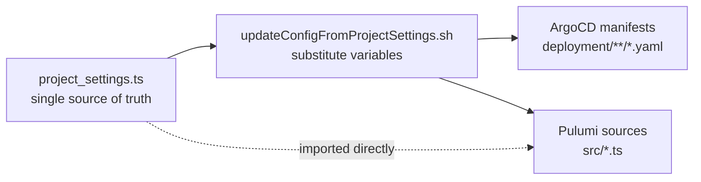
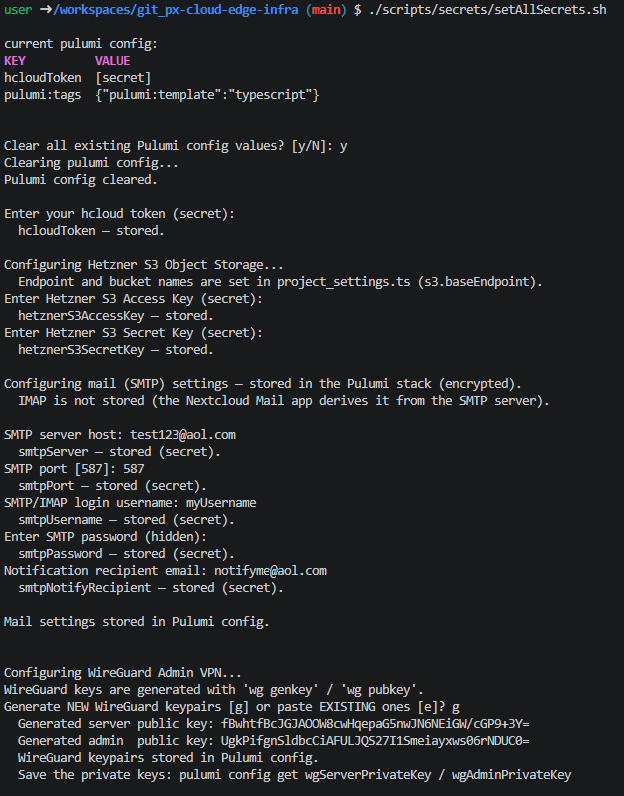
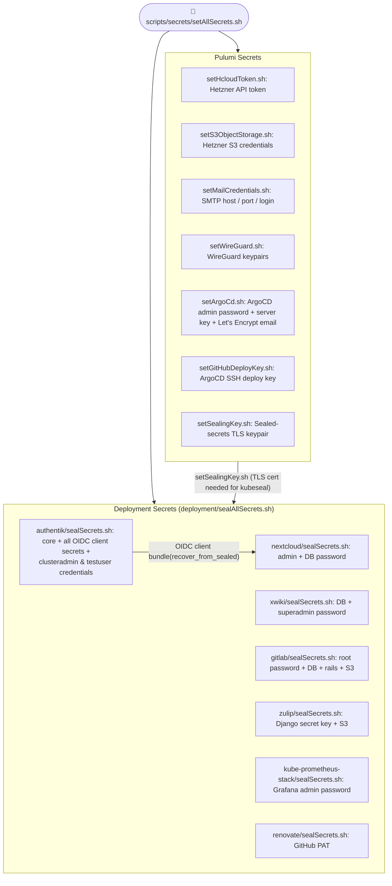
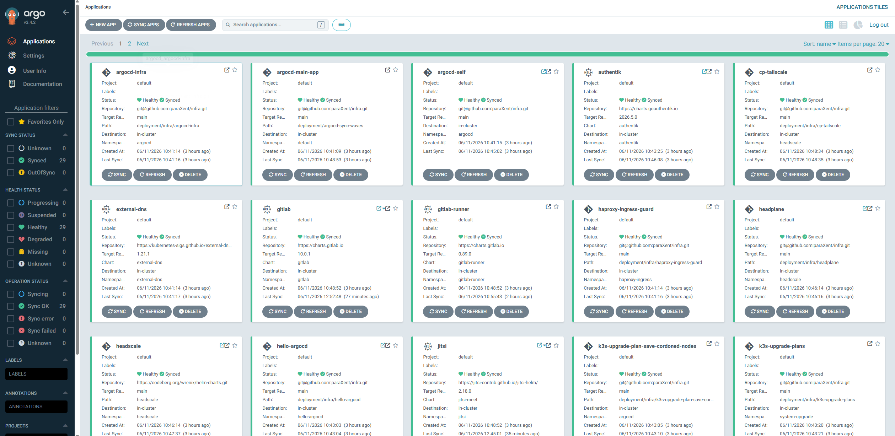
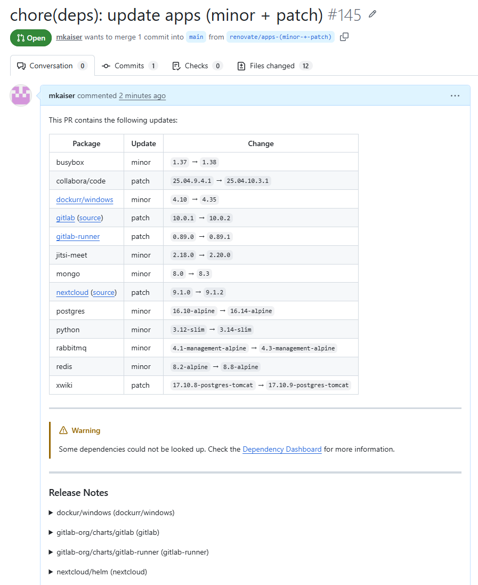
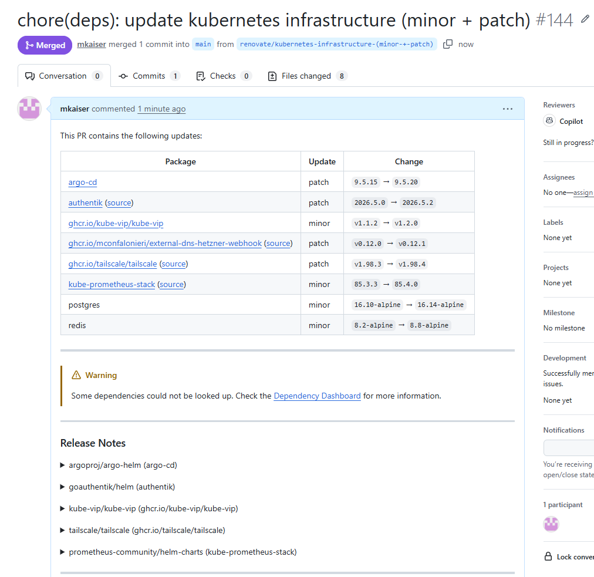

# Setup Instructions

## Step 0 - Prerequisites

1. Hetzner Account
    - Hetzner Console API Token
    - S3 Bucket access
        - Access key
        - Secret key
    - SSH Key (e.g. sshkey_ed25519_edgecloudinfra_Martin)
2. eMail address: no-reply@your-domain.tld (for lets encrypt certificate registration and eMail notifications)
3. Github account to fork this repo and a **classic access token**
   with pull request permissions (for renovate / automated checking for updates)
4. A good password manager, because you will create a lot secrets during the bootstrapping process, which you need to keep track of. I recommend [KeepassXC](www.keepassxc.org).
5. OS with Docker installed & VSCode with the DevContainer extension. Clone this project and open it in VSCode, then open the DevContainer when prompted (bottom right) or via the command palette (Ctrl+Shift+P → "Dev Containers: Reopen in Container"). The DevContainer has all required tools pre-installed and configured, so you can run all commands from the terminal inside it.
   Setting up the DevContainer the first time will take around 15 minutes.
6. Around ~2 hours from setup to a ready-to-use cluster:
    - 1h setup and configuration (git clone, startup DevContainer, [project_settings.ts](project_settings.ts), URL adjustments, entering access tokens/ secrets)
    - < 10 min automated infrastructure provisioning and app deployment via ArgoCD
    - 30 min for login, create accounts, add edge servers via VPN, test things
    - A couple of minutes give me some feedback and create issues ;)

## Step 1 - Edit configuration options

### A: project_settings.ts

[project_settings.ts](project_settings.ts) is the **single source of truth** in this project. Take your time and configure it as you need. Key fields to set before the first deploy among others are:

| Field            | Purpose                                                                  |
| ---------------- | ------------------------------------------------------------------------ |
| `clusterName`    | Pulumi/Hetzner resource prefix (e.g. `edgecloudinfra`)                   |
| `baseDomain`     | Your DNS zone (e.g. `cape-project.eu`)                                   |
| `subdomain`      | Per-cluster subdomain (e.g. `ecc107`) — increment on each recreate       |
| `certIssuerType` | `letsencrypt-staging` for testing, `letsencrypt-production` for real TLS |

Pulumi sources (`src/*.ts`) can import those settings directly, but ArgoCD with it's static YAML/Helm manifests can't — so you need to run a script to propagate the values into them.

After changing any propagated setting (domain, cert issuer, network ranges, HA replica counts) run:

```bash
./scripts/environment/updateConfigFromProjectSettings.sh
```

This script will perform a find-and-replace in all project files and lines marked with anchor comments like `# @anchorStart: pulumi_settings.general.baseDomain @anchorEnd` in YAML files or `// @anchorStart: pulumi_settings.ha.replicas.authentikPg.min @anchorEnd` in C-style comments.



### B: Enable / disable apps

ArgoCD deploys apps based on the presence of their `waveNN-<app>.yaml` in `/deployment/apps` at the latest stage of the cluster creation process (after the infrastructure). Note that apps have a sync wave starting at 20.

As the project comes with several pre-configured apps, it is recommended to disable most apps at the first cluster start to speed up the initial provisioning and then enable them one by one to check if they work as expected.
To enable or disable an app, add or remove the suffix `disable`, e.g. `waveNN-<app>.yaml.disable` and commit & push the file to git.
If the cluster is already running, it will pickup and apply such changes within 10 minutes.

## Step 2 - Pulumi setup

Now, we create a pulumi stack and insert required secrets for Pulumi and after that run-time kubernetes secrets.

```bash
source ./scripts/pulumi/initPulumiStack.sh
```

The script will ask you for to enter an existing or set a new passphrase for encrypting the Pulumi secrets. This will create the file `Pulumi.mystack.yaml`, where the secrets are stored in encrypted form.

## Step 3 - Set secrets

There is a script that walks through the process of settings all required secrets.

```bash
bash scripts/secrets/setAllSecrets.sh
```



The script covers:

- **Pulumi secrets** — Hetzner API token, S3 credentials, SMTP login, WireGuard keypairs, ArgoCD admin password + server key + Let's Encrypt email, GitHub deploy key, and the sealed-secrets TLS keypair.
- **Sealed deployment secrets** — Authentik core + every OIDC client secret, plus per-app passwords. This is also where you set the **`clusteradmin` and `testuser`** usernames, passwords, and emails (see Step 5).

> Sealed secrets are encrypted with the sealed-secrets public key (from Pulumi config) and are safe to commit. The script offers to commit the generated `*-sealed.yaml` files for you.
> Pass `--regenerate` to `setAllSecrets.sh` to rotate all auto-generated secrets without re-entering external credentials.

The guide leads you through the process. If you need to set or renew a single secrets, you can also run the individual scripts in `scripts/secrets/` or `deployment/*/sealSecrets.sh` for app secrets.



It is recommended to test if the pulumi stack and secrets have been correctly set by running a quick eMail test:m

```bashbash scripts/secrets/testMail.sh

```

This retrieves the kubeseal TLS certificate from the Pulumi stack, uses it to decrypt the SMTP credentials from the sealed secrets, and sends a test email to the address you entered during the secrets setup via CURL.

## Step 4 - Create the cluster

Now it is time to create the cluster. This is done by running:

`bash make create`

Notes:

- Provisioning of the server node and hand-over to ArgoCD takes **~5 minutes**; ArgoCD then deploys the apps wave by wave (see the section below).
- The ArgoCD CLI is logged in automatically at the end of `make create`. To reach the UI, open the ArgoCD URL from the Pulumi stack outputs.
- Monitor server resource usage with `./scripts/runtime/printResources.sh`, or watch the ArgoCD UI for per-app status.
- You will receive staged email notifications as the core services become ready, ending with **Cluster bootstrap complete**.

### First check

run `bash kubectl get nodes` to check if the control plane node is up and ready. If not, check the Pulumi logs for any errors during provisioning.

### ArgoCD Sync Wave Overview

Deployment is fully automated via ArgoCD sync waves. Barriers are sync-guard apps that block the next wave until all apps in the current wave are healthy.
This is required to ensure that depencies between apps are met, e.g., TLS certificates issuer must be ready before any app that needs certificates can be deployed, or the OIDC provider must be up before apps depending on it.

```mermaid
flowchart TD
    subgraph W0["Wave 0 · Bootstrap"]
        a0a[argocd-infra]
        a0b[external-dns]
        a0c[kube-vip]
        a0d[priorityclasses]
        a0e[haproxy-ingress-guard]
        a0f[sealed-secrets-guard]
        a0g[seaweedfs]
    end

    B1([barrier]):::barrier

    subgraph W2["Wave 2 · Core Services"]
        a2a[longhorn-config]
        a2b[kube-prometheus-stack]
        a2c[renovate]
        a2d[system-upgrade-controller]
        a2e[hello-argocd]
        a2f[cnpg]
        a2g[seaweedfs-csi]
    end

    subgraph W3["Wave 3"]
        B3([barrier]):::barrier
        a3[k3s-upgrade-plan-save-cordoned-nodes]
    end

    subgraph W4["Wave 4"]
        a4[k3s-upgrade-plans]
    end

    B5([barrier]):::barrier

    subgraph W6["Wave 6 · Identity"]
        a6[authentik · OIDC provider + initial users]
    end

    B7([barrier]):::barrier

    subgraph W8["Wave 8 · VPN Server"]
        a8a[headscale]
        a8b[headplane · Admin GUI]
    end

    B9([barrier]):::barrier

    subgraph W10["Wave 10 · VPN Clients"]
        a10[mesh-gateway · DaemonSet on CP nodes]
    end

    B18([barrier]):::barrier

    subgraph W19["Wave 19"]
        a19[notify · bootstrap complete email]
    end

    subgraph W20["Wave 20 · Apps"]
        a20a[nextcloud]
        a20b[xwiki]
        a20c[gitlab]
        a20d[gitlab-runner]
        a20e[jitsi]
        a20f[zulip]
        a20g[rocketchat]
        a20h[rallly]
        a20i[windows]
    end

    W0 --> B1 --> W2 --> W3 --> W4 --> B5 --> W6 --> B7 --> W8
    W8 --> B9 --> W10 --> B18 --> W19 --> W20

    classDef barrier fill:#f90,color:#000,stroke:#c60
```



## Step 5 — Harden for production / restrict firewall

- Confirm the admin WireGuard VPN connects — **do this before hardening or you may lock yourself out**.
- Set `rolloutType` to `"Production"` in [project_settings.ts](project_settings.ts).
- Run `make up` to apply production settings and restrict the firewall to a minimum.

# Step 6 (optional) — Integrate on-premises edge servers

There are two ways to integrate edge servers: a) via Pulumi provisioning (recommended for on-site servers with remote access) or b) via the offline provisioning scripts (for off-site servers or those without remote access, e.g. in a branch office or home lab).

## a) Pulumi provisioning

Add locally accessible edge servers to [project_settings.ts](project_settings.ts):project_settings.nodes.edge, then run `make provision-edge ARGS=<edge-node-group>` to provision them. Use the IP address from which your OS can reach the edge server. This is also okay for VPN-accessible nodes.

## b) Off-site node provisioning via scripts

**Step 1 — Generate the edge node scripts** (run from devcontainer):

```bash
./scripts/runtime/generateEdgeJoinScript.sh
```

This script:

- Fetches the headscale pre-auth key from the cluster
- Retrieves the k3s token and CP0 VPN IP via SSH over wireguard
- Outputs a self-contained scripts in `tmp/`

## Verify from devcontainer terminal:

```bash
kubectl get nodes   # edge node should appear as Ready
```


## Step 7 - Test login with the initial users

For testing purposes, two users are created automatically by the Authentik blueprint. You have set their usernames and passwords during the secret setup, e.g.,

| User          | Login username (default) | Display name    | Rights                                                                               |
| ------------- | ------------------------ | --------------- | ------------------------------------------------------------------------------------ |
| Cluster admin | `clusteradmin`           | `Cluster Admin` | authentik-admins, argocd-admins, xwiki-oidc-admin, gitlab-admins, employees-extended |
| Test user     | `testuser`               | `Test User`     | employees (standard user)                                                            |

> **Note:** `Cluster Admin` / `Test User` are the **display names** only. The actual **login usernames** (defaults `clusteradmin` / `testuser`) and their passwords are the values you entered during Step 3; they live in the `authentik-secrets` sealed secret.

You can recover a password like this:

```bash
kubectl get secret authentik-secrets -n authentik \
  -o jsonpath='{.data.CLUSTER_ADMIN_PASSWORD}' | base64 -d
```

Test single sign-on by logging in with `clusteradmin` at Authentik
(`https://id.<subdomain>.<baseDomain>`), then access ArgoCD, Grafana, Nextcloud, and XWiki — all use Authentik OIDC.

The dashboard should look like this:


Then proceed to ArgoCD and watch the status of the other app deployments:



# Step 8 - Updates

Every 6 hours all app components are checked for updates by [renovate](https://github.com/renovatebot/renovate). If an update is available, it will automatically create a pull request. You can also trigger this check manually by running:

```bash
scripts/environment/runRenovateOffline.sh
```

or

```bash
scripts/runtime/runRenovateViaKubernetes.sh
```





# Step 9 - cluster lifecycle management

see [cluster-lifecycle-management.md](cluster-lifecycle-management.md)
