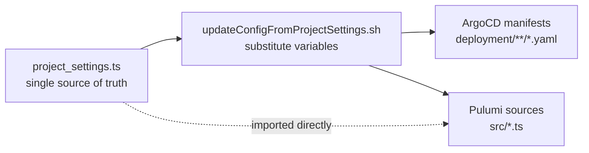
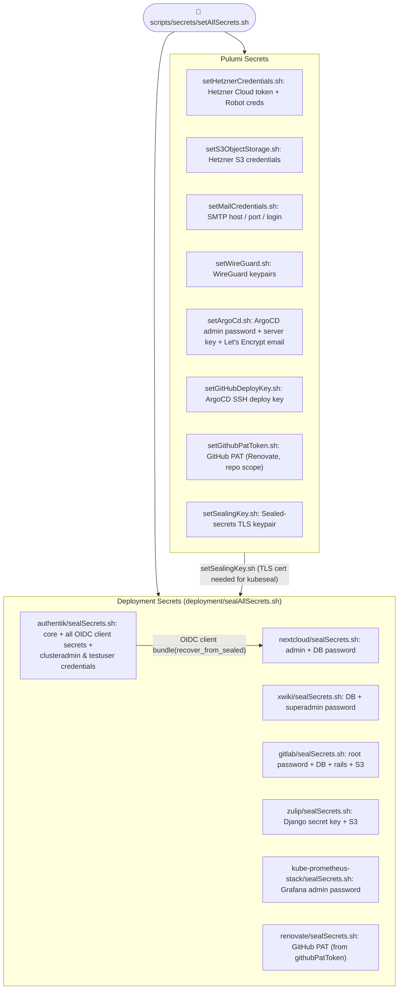

# Setup Instructions

The complete bootstrapping process will take around 2 hours from configuration to a ready-to-use cluster, follow the steps below.

## Step 0 - Prerequisites (30 minutes)

**A) Hetzner Account**

- Hetzner Console API Token
- S3 Bucket access
    - Access key
    - Secret key

**B) eMail address**

- e.g., `no-reply@your-domain.tld` for eMail notifications (account self-management/reset password) and Let's Encrypt certificate registration.

**C) GitHub account**

- to fork this repo, plus a **classic access token**
  with pull-request permissions (for Renovate / automated update checks)

**D) A good password manager**

- you will create many secrets during bootstrapping and need to track them. Recommended: [KeepassXC](https://www.keepassxc.org)

**E) OS with Docker + VSCode with the DevContainer extension**

- Clone this project, open the git root in VSCode. When prompted (bottom right), open the DevContainer or directly trigger it via the command palette (`Ctrl+Shift+P` → "Dev Containers: Reopen in Container").

- First-time DevContainer setup takes ~15 minutes.

**F) Run `make setup`**

- in a VSCode terminal to install required tools (kubeseal, argocd CLI, hcloud, kubectl, and more).

## Step 1 - Edit configuration options (10 minutes)

### A: project_settings.ts

[project_settings.ts](project_settings.ts) is the **single source of truth** in this project. Take your time and configure it as you need. Key fields to set before the first deploy among others are:

| Field                  | Purpose                                                                                   |
| ---------------------- | ----------------------------------------------------------------------------------------- |
| `general.name`         | Pulumi/Hetzner resource prefix (e.g. `edgecloudinfra`)                                    |
| `general.domain`       | Your DNS zone (e.g. `mydomain.tld`)                                                    |
| `general.subdomain`    | Per-cluster DNS label (incremented on recreate), or `""` for the bare apex — see below    |
| `tls.certIssuerType`   | `letsencrypt-staging` for testing, `letsencrypt-prod` for real TLS                        |

Pulumi sources (`src/*.ts`) can import settings from `project_settings.ts` directly, but ArgoCD with it's static YAML/Helm manifests can't — so you need to run a script to propagate the values into them. After changing any settings run:

```bash
./scripts/environment/updateConfigFromProjectSettings.sh
```

This script will perform a find-and-replace in all project files and lines marked with anchor comments `# automatically updated from project-settings:{general.subdomain,general.domain}` in YAML files or `// @anchorStart: pulumi_settings.ha.replicas.authentikPg.min @anchorEnd` in C-style comments.

#### Changing `general.domain`

Every rewrite in `updateConfigFromProjectSettings.sh` keys on the **new** domain, so a domain
change has to name the old one or the passes match nothing and the manifests silently keep the
old domain. The script handles this for you: it reads the previous domain off the `general.tld`
anchor in the tree, reports `Base domain change: <old> -> <new>`, and swaps it on every line
whose anchor names `general.domain` (plus `README.md`, which is meant to read generically).
Pass `--old-domain <previous>` when you already know the value —
`scripts/environment/prepareRelease.sh` does. Anything still on the old domain afterwards is
listed as a `NOTE`; the usual case is `mail.senderEmail`, which is a setting of its own and does
not move with the domain.

#### The two TLD shapes: per-cluster subdomain vs bare apex

`general.tld` is derived from `general.subdomain`:

- **non-empty** → `<subdomain>.<domain>` (`ecc196.example-domain.tld`). Every recreate gets a
  disposable DNS label and a fresh certificate SAN set.
- **empty (`""`)** → the bare apex `<domain>` (`mydomain.tld`).

Both are supported. The rewrite is driven by the `{general.subdomain,general.domain}` anchor,
which is the only signal that a hostname belongs to the cluster (from the apex, no regex can
tell `gitlab.example-domain.tld` from `www.example-domain.tld`), and that is what makes the switch
reversible in principle.

⚠ **Only the subdomain → apex direction has actually been exercised** (2026-09-07: a full
bootstrap → shutdown → restore on the bare apex, see
`plans/old/bare-apex-cluster-and-restore.md`). The apex → subdomain return is still untested;
treat it as expected-to-work rather than proven.

`scripts/environment/checkDomainAnchors.py` — run by `make check` and by the pre-commit hook —
fails if a cluster hostname is missing its anchor, which is what keeps the switch reversible. A
hostname that IS the bare TLD, with no service prefix, carries
`{general.subdomain,general.domain,general.tld}` instead.

Bare-apex mode has consequences worth accepting deliberately, and it suits a long-lived cluster
rather than one that is recreated every few days:

- **The apex zone is shared.** `@`/`www` (the project website), the DKIM TXT and the mail SRV
  records live there. The cluster's wildcard `*` answers for every UNCLAIMED name in the
  production domain; exact names keep working, and MX is unaffected because it points into a
  different zone (`your-server.de`). So the exposure is typos and probes, not mail.
  ⚠ Pulumi does NOT only write `*`: it also publishes the apex `@` SPF TXT, and it used to
  OWN that record — `make destroy` deleted the production SPF for the whole domain. Fixed
  2026-09-06: the apex SPF now goes through `ensureSharedDnsRrset` in `src/dns.ts`, which
  publishes only when the record is absent and never deletes it. Do not regress that to
  `createDnsRrset`. Take a zone snapshot before lifecycle work on a shared zone, and keep it
  OUTSIDE this repo — a full zone dump carries DKIM keys and the mail topology, which do not
  belong in a shared repository:
  `hcloud dns rrset list <domain> -o json > ~/zone-<domain>-$(date +%F).json`
- **Let's Encrypt duplicate-certificate limit.** 5 issuances per identical SAN set per 7 days.
  A per-cluster subdomain gives each recreate a fresh SAN set; the apex does not, so a recreate
  cadence above 5/week gets no production certificates.
  `updateConfigFromProjectSettings.sh` warns when the apex is combined with `letsencrypt-prod`.
- **VPN DNS widens.** The CoreDNS template in `src/wireguard.ts` serves the whole zone, so VPN
  clients resolve every name in the production domain to the mesh gateway.
- **Stale-record cleanup is weaker.** `scripts/environment/cleanExternalDnsRecords.sh` loses its
  name-based matcher (there is no disposable label) and relies on the external-dns heritage TXT
  alone.



### B: Enable / disable apps

ArgoCD deploys apps based on the presence of their `waveNN-<app>.yaml` in `/deployment/argocd-apps` at the latest stage of the cluster creation process (after the infrastructure). Note that apps have a sync wave starting at 20.

As the project comes with several pre-configured apps, it is recommended to disable most apps at the first cluster start to speed up the initial provisioning and then enable them one by one to check if they work as expected.
To enable or disable an app, add or remove the suffix `disable`, e.g. `waveNN-<app>.yaml.disable` and commit & push the file to git.
If the cluster is already running, it will pickup and apply such changes within 10 minutes.

## Step 2 - Pulumi setup

Now, we create a pulumi stack and insert required secrets for Pulumi and after that run-time kubernetes secrets.

```bash
source ./scripts/pulumi/initPulumiStack.sh
```

The script will ask you for to enter an existing or set a new passphrase for encrypting the Pulumi secrets. This will create the file `Pulumi.mystack.yaml`, where the secrets are stored in encrypted form.

## Step 3 - Set secrets (20 minutes)

There is a script that walks through the process of settings all required secrets.

```bash
bash scripts/secrets/setAllSecrets.sh
```


The script covers:

- **Pulumi secrets** — Hetzner API token, S3 credentials, SMTP login, WireGuard keypairs, ArgoCD admin password + server key + Let's Encrypt email, GitHub deploy key, and the sealed-secrets TLS keypair.
- **Sealed deployment secrets** — Authentik core + every OIDC client secret, plus per-app passwords. This is also where you set the **`clusteradmin` and `testuser`** usernames, passwords, and emails (see Step 5).

> Sealed secrets are encrypted with the sealed-secrets public key (from Pulumi config) and are safe to commit. The script offers to commit the generated `*-sealed.yaml` files for you.
> Pass `--regenerate` to `setAllSecrets.sh` to rotate all auto-generated secrets without re-entering external credentials.

The guide leads you through the process. If you need to set or renew a single secrets, you can also run the individual scripts in `scripts/secrets/` or `deployment/*/sealSecrets.sh` for app secrets.



Test that the Pulumi stack and the secrets are set correctly with a quick email test:

```bash
bash scripts/runtime/testMail.sh
```

It retrieves the kubeseal TLS certificate from the Pulumi stack, decrypts the SMTP
credentials out of the sealed secrets, and sends a test mail to the address entered during
secrets setup.


## Step 4 - Create the cluster (~40 min bootstrap + ~4 min infra apps; user apps continue in the background)

Now it is time to create the cluster. This is done by running:

`make bootstrap`

Notes:

- After the create, the run offers three steps interactively (production hardening, mesh-node provisioning, commit & push); each auto-**skips** on its timeout. Run `make bootstrap ARGS=--complete` to answer all three with yes and let the whole recreate proceed unattended.
- Provisioning of the server node and hand-over to ArgoCD takes **~17 minutes**; ArgoCD then deploys the apps wave by wave (see the section below).
- Measured wall-clock on a full recreate (2026-08-30, ecc186→ecc187): `make bootstrap` **41 min**, then the
  **argocd-infra** instance reaches all-Healthy about **4 min** later. See
  [cluster-lifecycle-management.md → Recreate timings](cluster-lifecycle-management.md#recreate-timings) for the
  per-phase breakdown.
- ⚠ The **argocd-apps** instance does NOT fully converge in that window. Apps that build their own
  container image (`remote-desktop`, `ollama`, `vllm`, and the EDA modules) come up only once GitLab CI
  has rebuilt those images, which is **hours** — their registry is in-cluster and dies with the cluster.
  An `ErrImagePull` on those apps right after a recreate is expected, not a fault.
- The ArgoCD CLI is logged in automatically at the end of `make bootstrap`. To reach the UI, open the ArgoCD URL from the Pulumi stack outputs.
- Monitor server resource usage with `./scripts/runtime/printResources.sh`, or watch the ArgoCD UI for per-app status.
- You will receive staged email notifications as the core services become ready, ending with **Cluster bootstrap complete**.

### First check

run `bash kubectl get nodes` to check if the control plane node is up and ready. If not, check the Pulumi logs for any errors during provisioning.

### ArgoCD Sync Wave Overview

Deployment is fully automated via ArgoCD sync waves. Barriers are sync-guard apps that block the next wave until all apps in the current wave are healthy.
This is required to ensure that depencies between apps are met, e.g., TLS certificates issuer must be ready before any app that needs certificates can be deployed, or the OIDC provider must be up before apps depending on it.

```mermaid
flowchart TD
    subgraph W0["Wave 0 · Bootstrap"]
        a0a[argocd-infra]
        a0b[cilium · CNI]
        a0c[gateway · Envoy Gateway]
        a0d[external-dns]
        a0e[kube-vip]
        a0f[priorityclasses]
        a0g[sealed-secrets-guard]
        a0h[seaweedfs]
    end

    subgraph W1["Wave 1"]
        B1([barrier]):::barrier
        a1[referencegrants]
    end

    subgraph W2["Wave 2 · Core Services"]
        a2a[longhorn-config]
        a2b[kube-prometheus-stack]
        a2c[cnpg]
        a2d[seaweedfs-csi]
        a2e[nested-runtime · runsc]
        a2f[nvidia-gpu]
        a2g[system-upgrade-controller]
    end

    subgraph W3["Wave 3"]
        B3([barrier]):::barrier
        a3[k3s-upgrade-plan-save-cordoned-nodes]
    end

    subgraph W4["Wave 4"]
        a4[k3s-upgrade-plans]
    end

    B5([barrier]):::barrier

    subgraph W6["Wave 6 · Identity"]
        a6[authentik · OIDC provider + initial users]
    end

    B7([barrier]):::barrier

    subgraph W8["Wave 8 · VPN Server"]
        a8a[headscale]
        a8b[headplane · Admin GUI]
    end

    B9([barrier]):::barrier

    subgraph W10["Wave 10 · VPN Clients"]
        a10a[mesh-gateway · DaemonSet on CP nodes]
        a10b[node-guard · mesh_antiloop nft]
    end

    subgraph W1117["Waves 11-17 · Platform"]
        a11[11 mesh-monitoring]
        a12[12 descheduler]
        a13[13 samba-ad · AD DCs]
        a14[14 grafana + loki]
        a15[15 alloy]
        a16[16 truenas · appliance provisioning]
        a17[17 csi-driver-nfs]
    end

    B18([barrier]):::barrier

    subgraph W19["Wave 19"]
        a19a[argocd-apps · the second ArgoCD]
        a19b[notify · bootstrap complete email]
        a19c[renovate]
    end

    subgraph APPS["argocd-apps instance · app-of-apps"]
        p1[gitlab + runners]
        p2[nextcloud · xwiki · zulip · rocketchat]
        p3[jitsi · rallly · zammad · searxng]
        p4[windows · remote-desktop]
        p5[eda: registry · fileserver · modules]
        p6[ai: litellm · open-webui · ollama · vllm · hermes]
    end

    W0 --> W1 --> W2 --> W3 --> W4 --> B5 --> W6 --> B7 --> W8
    W8 --> B9 --> W10 --> W1117 --> B18 --> W19 --> APPS

    classDef barrier fill:#f90,color:#000,stroke:#c60
```



## Step 5 — Harden for production / restrict firewall (5 minutes)

- Run `make production`. It flips `general.targetState` to `"production"`, resyncs the manifests
  and runs `pulumi up` — and it **verifies the admin WireGuard tunnel actually works
  first** (a live `ssh` probe over the tunnel); with a dead tunnel it refuses, because
  closing public SSH would lock you out. Override with `make production ARGS=--force`.
- Public SSH (22) and the k3s API (6443) are then closed on the public NIC; the VPN is
  the only way in.
- Re-open for maintenance with `make bootstrap`. Locked out? `make breakglass`
  (no pulumi/kubernetes needed — see [network-firewall.md](network-firewall.md)).

## Step 6 (optional) — Integrate on-premise mesh nodes (10 minutes)

There are two ways to integrate mesh nodes: a) via Pulumi provisioning (recommended for on-site servers with remote access) or b) via the offline provisioning scripts (for off-site servers or those without remote access, e.g. in a branch office or home lab).

**Prerequisite:** the SSH user on each mesh box needs **passwordless sudo** (both paths run every step as `sudo` non-interactively). GPU (Jetson) nodes also need JetPack pre-flashed. See [cluster-lifecycle-management.md → Node prerequisites](cluster-lifecycle-management.md#mesh-node-provisioning).

### a) Pulumi provisioning

Add locally accessible mesh nodes to [project_settings.ts](project_settings.ts):project_settings.nodes.mesh, then run `make provision-mesh-node ARGS=<node-id>` to provision them. Use the IP address from which your OS can reach the mesh node. This is also okay for VPN-accessible nodes. See [cluster-lifecycle-management.md](cluster-lifecycle-management.md#mesh-node-provisioning) for `--force`, skip-by-default, and the manual/debug path.

### b) Off-site node provisioning via scripts

**Step 1 — Generate the mesh node scripts** (run from devcontainer):

```bash
./scripts/provisioning/generateProvisioningScripts.sh
```

This script:

- Fetches the headscale pre-auth key from the cluster
- Retrieves the k3s token and CP0 VPN IP via SSH over wireguard
- Outputs a self-contained scripts in `tmp/`

### Verify from devcontainer terminal:

```bash
kubectl get nodes   # mesh node should appear as Ready
```


## Step 7 - Test login with the initial users (15 minutes)

For testing purposes, two users are created automatically by the Authentik blueprint. You have set their usernames and passwords during the secret setup, e.g.,

| User          | Login username | Display name    | Rights                                                                               |
| ------------- | -------------- | --------------- | ------------------------------------------------------------------------------------ |
| Cluster admin | `clusteradmin` | `Cluster Admin` | authentik-admins, argocd-admins, xwiki-oidc-admin, gitlab-admins, employees-extended |
| Test user     | `testuser`     | `Test User`     | employees (standard user)                                                            |

> **Note:** `Cluster Admin` / `Test User` are the **display names** only. The actual **login usernames** (defaults `clusteradmin` / `testuser`) and their passwords are the values you entered during Step 3; they live in the `authentik-secrets` sealed secret.

You can recover a password like this:

```bash
kubectl get secret authentik-secrets -n authentik \
  -o jsonpath='{.data.CLUSTER_ADMIN_PASSWORD}' | base64 -d
```

Test single sign-on by logging in with `clusteradmin` at Authentik
(`https://id.<subdomain>.<baseDomain>`), then access ArgoCD, Grafana, Nextcloud, and XWiki — all use Authentik OIDC.

The dashboard should look like this:


Then proceed to ArgoCD and watch the status of the other app deployments:


## Step 8 - Updates (2 minutes/update, click-ops)

Every 6 hours all app components are checked for updates by [renovate](https://github.com/renovatebot/renovate). If an update is available, it will automatically create a pull request. You can also trigger this check manually by running:

```bash
scripts/environment/runRenovateOffline.sh
```

or

```bash
scripts/runtime/runRenovateViaKubernetes.sh
```


## Step 9 - cluster lifecycle management

see [cluster-lifecycle-management.md](cluster-lifecycle-management.md)
